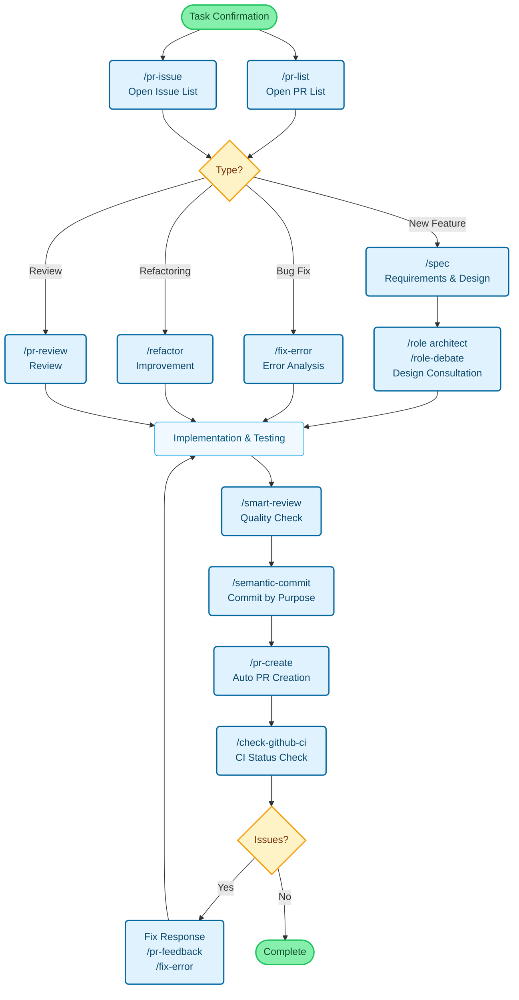

# Claude Code Cookbook

A collection of commands, roles, and automation scripts for [Claude Code](https://docs.claude.com/).

**Automate your workflow without unnecessary confirmations**, allowing you to focus on what matters. Claude Code judges and executes common tasks like code fixes, test runs, and documentation updates.

**Read in your language**: [🇯🇵 日本語](plugins/ja/README.md) · [🇺🇸 English](plugins/en/README.md) · [🇰🇷 한국어](plugins/ko/README.md) · [🇨🇳 简体中文](plugins/zh-cn/README.md) · [🇹🇼 繁體中文](plugins/zh-tw/README.md) · [🇪🇸 Español](plugins/es/README.md) · [🇫🇷 Français](plugins/fr/README.md) · [🇧🇷 Português](plugins/pt/README.md)

## What is Claude Code Cookbook?

Claude Code Cookbook provides a plugin system that extends Claude Code with:

- **Commands**: Custom slash commands for common development tasks
- **Roles**: Expert role presets for specialized assistance
- **Hooks**: Automated scripts that trigger at specific events

## Key Features

### Commands

39 slash commands organized by category. Execute by typing `/` followed by the command name.

#### Pull Request Management

| Command           | Description                                                                          |
| :---------------- | :----------------------------------------------------------------------------------- |
| `/pr-list`        | Display prioritized list of open PRs in current repository                           |
| `/pr-issue`       | Display prioritized list of open Issues in current repository                        |
| `/pr-create`      | Auto-generate PR from Git changes with detailed description and optimal branch setup |
| `/pr-review`      | Systematic code quality and architecture review for Pull Requests                    |
| `/pr-feedback`    | Efficiently respond to PR review comments with 3-stage error analysis                |
| `/pr-auto-update` | Automatically update PR description and labels based on changes                      |

#### Code Quality & Refactoring

| Command                 | Description                                                          |
| :---------------------- | :------------------------------------------------------------------- |
| `/refactor`             | Safe, step-by-step code refactoring with SOLID principles evaluation |
| `/smart-review`         | Advanced code review to improve quality                              |
| `/tech-debt`            | Analyze technical debt and create prioritized improvement plans      |
| `/analyze-dependencies` | Analyze project dependencies and visualize circular dependencies     |
| `/analyze-performance`  | Analyze application performance issues and propose improvements      |
| `/design-patterns`      | Propose and review implementations based on design patterns          |

#### Development Tools

| Command            | Description                                                             |
| :----------------- | :---------------------------------------------------------------------- |
| `/fix-error`       | Suggest code fixes based on error messages                              |
| `/explain-code`    | Clearly explain functionality and logic of selected code                |
| `/commit-message`  | Generate commit messages based on changes                               |
| `/semantic-commit` | Split large changes into meaningful units with semantic commit messages |
| `/check-github-ci` | Monitor GitHub Actions CI status and track until completion             |
| `/screenshot`      | Capture and analyze screen screenshots                                  |

#### Planning & Analysis

| Command                | Description                                                                   |
| :--------------------- | :---------------------------------------------------------------------------- |
| `/plan`                | Activate planning mode and formulate detailed implementation strategies       |
| `/spec`                | Create detailed specifications from requirements (spec-driven development)    |
| `/ultrathink`          | Execute structured thinking process for complex issues                        |
| `/check-fact`          | Verify information accuracy by referencing codebase and documentation         |
| `/sequential-thinking` | Think through complex problems step-by-step using Sequential Thinking MCP     |
| `/task`                | Launch specialized agents for autonomous search, research, and analysis tasks |

#### Dependency Management

| Command                | Description                                    |
| :--------------------- | :--------------------------------------------- |
| `/update-node-deps`    | Safely update dependencies in Node.js projects |
| `/update-flutter-deps` | Safely update dependencies in Flutter projects |
| `/update-rust-deps`    | Safely update dependencies in Rust projects    |

**See your language plugin for the complete list of 39 commands with detailed documentation.**

### Roles

Switch Claude to expert roles for specialized assistance. Each role can run **independently as a sub-agent** using the `--agent` option for parallel execution without interfering with main context.

| Role          | Description                                              |
| :------------ | :------------------------------------------------------- |
| `security`    | Security vulnerability analysis and threat detection     |
| `architect`   | Software architecture design and system design patterns  |
| `frontend`    | UI/UX optimization and frontend best practices           |
| `backend`     | API design, microservices, and cloud-native architecture |
| `performance` | Performance optimization for speed and memory            |
| `qa`          | Test planning and quality assurance strategies           |
| `mobile`      | iOS/Android development and mobile-first design          |
| `reviewer`    | Code review focusing on readability and maintainability  |
| `analyzer`    | System analysis and root cause analysis                  |

#### Usage Examples

```bash
# Normal mode (execute in main context)
/role security
"Review this authentication system for vulnerabilities"

# Sub-agent mode (execute in independent context)
/role security --agent
"Perform comprehensive security audit of entire project"

# Multiple roles in parallel
/multi-role security,performance --agent
"Analyze system's security and performance comprehensively"
```

### Hooks

Automate development workflow with event-triggered scripts configured in `settings.json`:

| Hook Script                    | Event                        | Description                                                 |
| :----------------------------- | :--------------------------- | :---------------------------------------------------------- |
| `preserve-file-permissions.sh` | `PreToolUse` / `PostToolUse` | Save and restore file permissions to prevent unintended changes |

## Development Workflow

Typical development flow using Claude Code Cookbook commands:



## Installation

### Step 1: Add the Marketplace

First, add this repository as a plugin marketplace in Claude Code:

```bash
/plugin marketplace add wasabeef/claude-code-cookbook
```

### Step 2: Install Your Language Plugin

Choose and install your preferred language plugin:

| Language         | Plugin Name                    | Install Command                                   |
| :--------------- | :----------------------------- | :------------------------------------------------ |
| 🇯🇵 **日本語**    | [plugins/ja](plugins/ja)       | `/plugin install cook@claude-code-cookbook`       |
| 🇺🇸 **English**   | [plugins/en](plugins/en)       | `/plugin install cook-en@claude-code-cookbook`    |
| 🇰🇷 **한국어**    | [plugins/ko](plugins/ko)       | `/plugin install cook-ko@claude-code-cookbook`    |
| 🇨🇳 **简体中文**  | [plugins/zh-cn](plugins/zh-cn) | `/plugin install cook-zh-cn@claude-code-cookbook` |
| 🇹🇼 **繁體中文**  | [plugins/zh-tw](plugins/zh-tw) | `/plugin install cook-zh-tw@claude-code-cookbook` |
| 🇪🇸 **Español**   | [plugins/es](plugins/es)       | `/plugin install cook-es@claude-code-cookbook`    |
| 🇫🇷 **Français**  | [plugins/fr](plugins/fr)       | `/plugin install cook-fr@claude-code-cookbook`    |
| 🇧🇷 **Português** | [plugins/pt](plugins/pt)       | `/plugin install cook-pt@claude-code-cookbook`    |

Each plugin includes:

- Full command documentation in the native language
- Role definitions optimized for that language
- Language-specific customization examples

### Quick Start

After installation, commands and agents are invoked with a plugin-specific prefix:

```bash
# Commands (example with Japanese plugin)
/cook:pr-create
/cook:semantic-commit
/cook:check-fact

# Agents
@agent-cook:frontend
/cook:role security

# Explore available commands
/cook:
```

**Note**: The plugin name is automatically added as a prefix to prevent namespace conflicts when multiple language plugins are installed.

## Why Claude Code Cookbook?

- **Multilingual**: 8 language plugins with native translations
- **Production-ready**: Battle-tested commands and roles
- **Comprehensive**: 39 commands covering entire development workflow
- **Extensible**: Easy to add your own commands and roles
- **Safe**: Built-in safety hooks prevent dangerous operations
- **Efficient**: Reduce repetitive tasks and context switching
- **Open Source**: Apache 2.0 licensed

## Example Workflow

```bash
# 1. Check current tasks
/cook:pr-list

# 2. Plan new feature
/cook:spec
/cook:role architect

# 3. Implement with quality checks
# ... write code ...
/cook:smart-review

# 4. Commit changes logically
/cook:semantic-commit

# 5. Create PR automatically
/cook:pr-create

# 6. Monitor CI and respond to feedback
/cook:check-github-ci
/cook:pr-feedback
```
