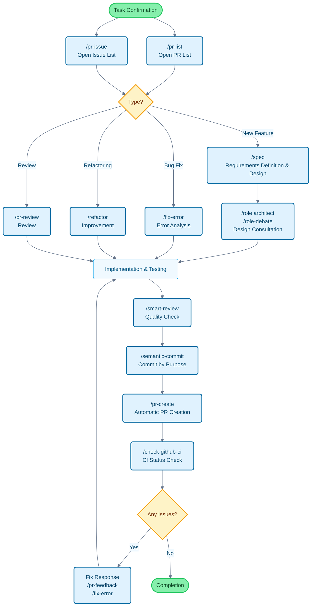

# Claude Code Cookbook

A collection of settings to make Claude Code more useful.

It automatically proceeds with work without unnecessary confirmations, allowing you to focus on what you really want to do. Claude Code judges and executes common tasks like code fixes, test runs, and documentation updates.

## Key Features

You can customize Claude Code's behavior with three features:

- **Commands**: Custom commands starting with `/`
- **Roles**: Role settings to answer from an expert's perspective
- **Hooks**: Automatically execute scripts at specific times

---

## Feature List

### Commands

Stored as Markdown files in the `/commands` directory. Execute by entering the filename after `/`.

| Command | Description |
| :--- | :--- |
| `/analyze-dependencies` | Analyze project dependencies and visualize circular dependencies and structural issues. |
| `/analyze-performance` | Analyze application performance issues and propose improvements from a technical debt perspective. |
| `/check-fact` | Check the accuracy of given information by referring to the project's codebase and documentation. |
| `/check-github-ci` | Monitor GitHub Actions CI status and track until completion. |
| `/check-prompt` | Review the current prompt content and suggest improvements. |
| `/commit-message` | Generate only commit messages based on changes. |
| `/context7` | Perform context management using Context7 MCP. |
| `/design-patterns` | Propose and review implementations based on design patterns. |
| `/explain-code` | Clearly explain the functionality and logic of selected code. |
| `/fix-error` | Suggest code fixes based on error messages. |
| `/multi-role` | Combine multiple roles to analyze the same target in parallel and generate an integrated report. |
| `/plan` |启动 implementation planning mode before implementation and formulate detailed implementation strategies. |
| `/pr-auto-update` | Automatically update Pull Request content (description, labels). |
| `/pr-create` | Enable efficient Pull Request workflows with automatic PR creation based on Git change analysis. |
| `/pr-feedback` | Efficiently respond to Pull Request review comments and aim for root solutions with a 3-stage error analysis approach. |
| `/pr-issue` | Display a prioritized list of open Issues in the current repository. |
| `/pr-list` | Display a prioritized list of open PRs in the current repository. |
| `/pr-review` | Ensure code quality and architectural soundness through systematic review of Pull Requests. |
| `/refactor` | Perform safe, step-by-step code refactoring and evaluate adherence to SOLID principles. |
| `/role-debate` | Have multiple roles debate specific topics. |
| `/role-help` | Display a list and description of available Roles. |
| `/role` | Act as the specified role. |
| `/screenshot` | Capture and analyze screen screenshots |
| `/search-gemini` | Perform web searches using Gemini. |
| `/semantic-commit` | Divide large changes into meaningful minimum units and commit sequentially with semantic commit messages. |
| `/sequential-thinking` | Use Sequential Thinking MCP to think through complex problems step by step and reach conclusions. |
| `/show-plan` | Display the current execution plan. |
| `/smart-review` | Perform advanced reviews to improve code quality. |
| `/spec` | Create detailed specifications step by step from requirements, following Kiro's spec-driven development. |
| `/style-ai-writing` | Detect and correct unnatural AI-generated text. |
| `/task` |启动 dedicated agents to autonomously execute complex search, research, and analysis tasks. |
| `/tech-debt` | Analyze project technical debt and create prioritized improvement plans. |
| `/ultrathink` | Perform step-by-step structured thinking processes for complex issues and important decisions. |
| `/update-dart-doc` | Systematically manage DartDoc comments in Dart files and maintain high-quality Japanese documentation. |
| `/update-doc-string` | Uniquely manage and update documentation strings supporting multiple languages. |
| `/update-flutter-deps` | Safely update dependencies in Flutter projects. |
| `/update-node-deps` | Safely update dependencies in Node.js projects. |
| `/update-rust-deps` | Safely update dependencies in Rust projects. |

### Roles

Defined in Markdown files in the `agents/roles/` directory. Give Claude an expert perspective for more accurate answers.

Each role can also be executed **independently as a sub-agent**. Using the `--agent` option allows parallel execution of large-scale analysis and specialized processing without interfering with the main conversation context.

| Role | Description |
| :--- | :--- |
| `/role analyzer` | Analyze code and architecture as a system analysis expert. |
| `/role architect` | Review and propose designs as a software architect. |
| `/role frontend` | Advise on UI/UX and performance as a frontend expert. |
| `/role mobile` | Answer based on iOS/Android best practices as a mobile app development expert. |
| `/role performance` | Suggest improvements to speed and memory usage as a performance optimization expert. |
| `/role qa` | Review from a test planning and quality assurance perspective as a QA engineer. |
| `/role reviewer` | Evaluate code from readability and maintainability perspectives as a code reviewer. |
| `/role security` | Point out vulnerabilities and security risks as a security expert. |

#### Sub-agent Execution Examples

```bash
# Normal mode (execute in main context)
/role security
"Security check for this project"

# Sub-agent mode (execute in independent context)
/role security --agent
"Perform a comprehensive security audit of the project"

# Parallel analysis with multiple roles
/multi-role security,performance --agent
"Comprehensively analyze the system's security and performance"
```

### Hooks

Configure in `settings.json` to automate development work.

| Execution Script | Event | Description |
| :--- | :--- | :--- |
| `deny-check.sh` | `PreToolUse` | Prevent execution of dangerous commands like `rm -rf /`. |
| `check-ai-commit.sh` | `PreToolUse` | Error when commit messages include AI signatures in `git commit`. |
| `preserve-file-permissions.sh` | `PreToolUse` / `PostToolUse` | Save original permissions before file editing and restore after editing. Prevent Claude Code from changing permissions. |
| `ja-space-format.sh` | `PostToolUse` | Automatically format spaces between Japanese and alphanumeric characters when saving files. |
| `auto-comment.sh` | `PostToolUse` | Prompt for addition of docstrings and API documentation when creating new files or making major edits. |
| `notify-waiting` | `Notification` | Notify via macOS Notification Center when Claude is waiting for user confirmation. |
| `check-continue.sh` | `Stop` | Check for continuable tasks when tasks are completed. |
| `(osascript)` | `Stop` | Notify completion via macOS Notification Center when all tasks are completed. |

---

## Development Flow and Command Usage Guide

### Example of Command Utilization in General Development Flow



---

## Installation and Customization

### Installation Steps

1. **Clone the repository**: `git clone https://github.com/wasabeef/claude-code-cookbook.git ~/.claude`
2. **Set the path in client**: Specify the path to the above directory in Claude's client
3. **Check paths**: Verify that script paths in `settings.json` match your environment

### Customization

- **Add commands**: Simply add `.md` files to `commands/`
- **Add roles**: Simply add `.md` files to `agents/roles/`
- **Edit hooks**: Edit `settings.json` to change automation processes