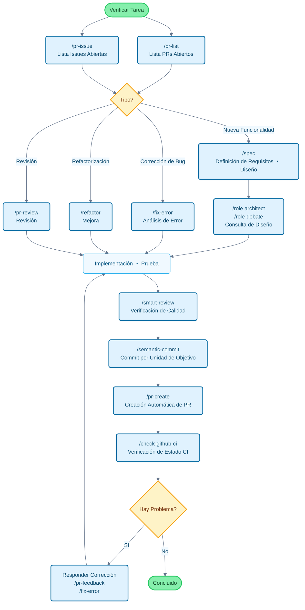

# Claude Code Cookbook

[English](README_en.md) | [中文](README_zh.md) | [한국어](README_ko.md) | [Português](README_pt.md) | [Español](README_es.md) | [日本語](README.md)

Una colección de configuraciones para hacer que Claude Code sea más fácil de usar.

Al evitar confirmaciones detalladas y proceder automáticamente con las tareas, puedes concentrarte en lo que realmente quieres hacer.
Claude Code juzga y ejecuta tareas comunes como corrección de código, ejecución de pruebas y actualización de documentación.

## Características Principales

Puedes personalizar el comportamiento de Claude Code con tres funciones:

- **Commands**: Comandos personalizados que comienzan con `/`
- **Roles**: Configuraciones de roles para responder desde perspectivas de expertos
- **Hooks**: Ejecución automática de scripts en momentos específicos

---

## Lista de Funciones

### Commands (Comandos Personalizados)

Guardados como archivos Markdown en el directorio `/commands`. Se ejecutan escribiendo `/` seguido del nombre del archivo.

| Comando | Descripción |
| :--- | :--- |
| `/analyze-dependencies` | Analiza las dependencias del proyecto y visualiza dependencias circulares y problemas estructurales. |
| `/analyze-performance` | Analiza problemas de rendimiento de la aplicación y propone mejoras desde la perspectiva de deuda técnica. |
| `/check-fact` | Verifica la veracidad de la información proporcionada consultando el código y documentación del proyecto. |
| `/check-github-ci` | Monitoriza el estado de CI de GitHub Actions y rastrea hasta completarse. |
| `/check-prompt` | Revisa el contenido del prompt actual y presenta sugerencias de mejora. |
| `/commit-message` | Genera solo el mensaje de commit basado en los cambios. |
| `/context7` | Gestiona el contexto usando Context7 MCP. |
| `/design-patterns` | Propone y revisa implementaciones basadas en patrones de diseño. |
| `/explain-code` | Explica claramente la funcionalidad y lógica del código seleccionado. |
| `/fix-error` | Propone soluciones de código basadas en mensajes de error. |
| `/multi-role` | Combina múltiples roles para análisis paralelo del mismo objetivo y genera un informe integrado. |
| `/plan` | Activa el modo de planificación previa a la implementación y formula estrategias detalladas. |
| `/pr-auto-update` | Actualiza automáticamente el contenido del Pull Request (descripción, etiquetas). |
| `/pr-create` | Crea PRs automáticamente basándose en análisis de cambios Git para un flujo de trabajo eficiente. |
| `/pr-feedback` | Responde eficientemente a comentarios de revisión de PR con enfoque de tres etapas para solución fundamental. |
| `/pr-issue` | Muestra lista de Issues abiertas del repositorio actual con priorización. |
| `/pr-list` | Muestra lista de PRs abiertos del repositorio actual con priorización. |
| `/pr-review` | Asegura calidad del código y salud arquitectónica con revisión sistemática de PR. |
| `/refactor` | Ejecuta refactorización segura y gradual evaluando cumplimiento de principios SOLID. |
| `/role-debate` | Hace que múltiples roles debatan sobre un tema específico. |
| `/role-help` | Muestra lista y descripción de Roles disponibles. |
| `/role` | Actúa como el rol especificado. |
| `/screenshot` | Captura y analiza capturas de pantalla. |
| `/search-gemini` | Realiza búsquedas web usando Gemini. |
| `/semantic-commit` | Divide cambios grandes en unidades mínimas significativas con mensajes de commit semánticos. |
| `/sequential-thinking` | Usa Sequential Thinking MCP para pensar problemas complejos paso a paso y llegar a conclusiones. |
| `/show-plan` | Muestra el plan de ejecución actual. |
| `/smart-review` | Realiza revisiones avanzadas para mejorar la calidad del código. |
| `/spec` | Crea especificaciones detalladas paso a paso siguiendo el desarrollo dirigido por especificaciones de Kiro. |
| `/style-ai-writting` | Detecta y corrige texto antinatural generado por IA. |
| `/task` | Lanza agentes dedicados para ejecutar tareas complejas de búsqueda, investigación y análisis de forma autónoma. |
| `/tech-debt` | Analiza la deuda técnica del proyecto y crea un plan de mejora priorizado. |
| `/ultrathink` | Ejecuta un proceso de pensamiento estructurado y gradual para problemas complejos o decisiones importantes. |
| `/update-dart-doc` | Gestiona sistemáticamente comentarios DartDoc en archivos Dart y mantiene documentación de alta calidad. |
| `/update-doc-string` | Gestiona y actualiza cadenas de documentación de forma unificada para múltiples idiomas. |
| `/update-flutter-deps` | Actualiza de forma segura las dependencias del proyecto Flutter. |
| `/update-node-deps` | Actualiza de forma segura las dependencias del proyecto Node.js. |
| `/update-rust-deps` | Actualiza de forma segura las dependencias del proyecto Rust. |

### Roles (Configuración de Roles)

Definidos en archivos Markdown dentro del directorio `agents/roles/`. Permite que Claude tenga perspectivas de expertos para respuestas más precisas.

Cada rol también puede **ejecutarse independientemente como subagente**. Usando la opción `--agent`, puedes ejecutar análisis a gran escala o procesamiento especializado en paralelo sin interferir con el contexto de conversación principal.

| Rol | Descripción |
| :--- | :--- |
| `/role analyzer` | Como experto en análisis de sistemas, analiza código y arquitectura. |
| `/role architect` | Como arquitecto de software, revisa y propone sobre diseño. |
| `/role frontend` | Como experto en frontend, asesora sobre UI/UX y rendimiento. |
| `/role mobile` | Como experto en desarrollo móvil, responde basándose en mejores prácticas de iOS/Android. |
| `/role performance` | Como experto en optimización de rendimiento, propone mejoras de velocidad y uso de memoria. |
| `/role qa` | Como ingeniero QA, revisa desde la perspectiva de planes de prueba y aseguramiento de calidad. |
| `/role reviewer` | Como revisor de código, evalúa código desde perspectivas de legibilidad y mantenibilidad. |
| `/role security` | Como experto en seguridad, señala vulnerabilidades y riesgos de seguridad. |

#### Ejemplos de Ejecución de Subagentes

```bash
# Modo normal (ejecuta en contexto principal)
/role security
"Verificación de seguridad de este proyecto"

# Modo subagente (ejecuta en contexto independiente)
/role security --agent
"Ejecutar auditoría de seguridad completa del proyecto"

# Análisis paralelo de múltiples roles
/multi-role security,performance --agent
"Análisis integral de seguridad y rendimiento del sistema completo"
```

### Hooks (Scripts de Automatización)

Configure en `settings.json` para automatizar tareas de desarrollo.

| Script de Ejecución | Evento | Descripción |
| :--- | :--- | :--- |
| `deny-check.sh` | `PreToolUse` | Previene la ejecución de comandos peligrosos como `rm -rf /`. |
| `check-ai-commit.sh` | `PreToolUse` | Genera error cuando `git commit` contiene firma de IA en el mensaje de commit. |
| `preserve-file-permissions.sh` | `PreToolUse` / `PostToolUse` | Guarda permisos originales antes de editar archivo y restaura después de edición. Previene que Claude Code cambie permisos. |
| `ja-space-format.sh` | `PostToolUse` | Formatea automáticamente espacios entre texto japonés y caracteres alfanuméricos al guardar archivo. |
| `auto-comment.sh` | `PostToolUse` | Solicita adición de docstring o documentación API al crear nuevo archivo o hacer ediciones significativas. |
| `notify-waiting` | `Notification` | Notifica vía centro de notificaciones de macOS cuando Claude está esperando confirmación del usuario. |
| `check-continue.sh` | `Stop` | Verifica si hay tareas que pueden continuar al completar tarea. |
| `(osascript)` | `Stop` | Notifica finalización vía centro de notificaciones de macOS cuando todas las tareas están completas. |

---

## Flujo de Desarrollo y Guía de Uso de Comandos

### Ejemplos de Uso de Comandos en Flujo de Desarrollo Típico



---

## Instalación

```bash
# Clonar repositorio
git clone https://github.com/wasabeef/claude-code-cookbook.git
cd claude-code-cookbook

# Instalar especificando idioma
./scripts/install.sh ja    # Japonés (predeterminado)
./scripts/install.sh en    # Inglés
./scripts/install.sh ko    # Coreano
./scripts/install.sh pt    # Portugués
./scripts/install.sh zh    # Chino
./scripts/install.sh es    # Español
```

Configurar la ruta de Custom Instructions en Claude Desktop como `~/.claude` y listo.

### Personalización

- **Agregar comandos**: Solo agrega archivos `.md` en `commands/`
- **Agregar roles**: Solo agrega archivos `.md` en `agents/roles/`
- **Editar Hooks**: Edita `settings.json` para cambiar el procesamiento automático
