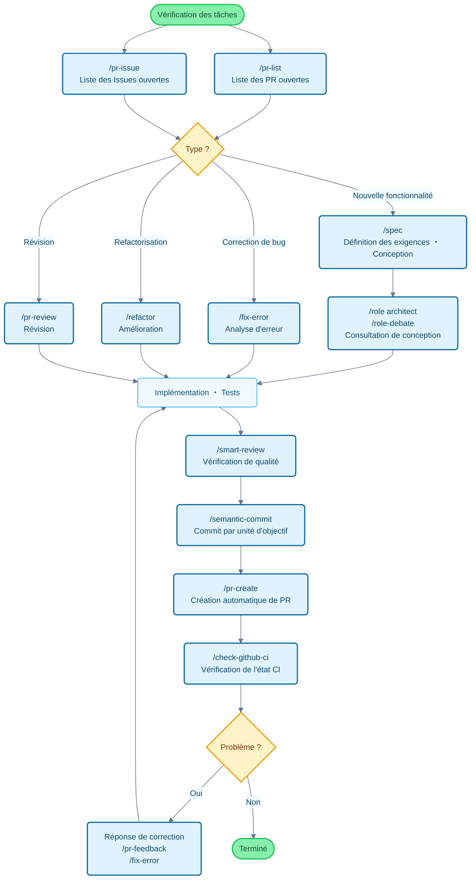

# Claude Code Cookbook

[English](README_en.md) | [简体中文](README_zh-cn.md) | [繁體中文](README_zh-tw.md) | [한국어](README_ko.md) | [Português](README_pt.md) | [Español](README_es.md) | [Français](README_fr.md) | [日本語](README.md) | [📁 locales/](locales/)

Une collection de configurations pour utiliser Claude Code plus efficacement.

En supprimant les confirmations détaillées et en automatisant les tâches, vous pouvez vous concentrer sur l'essentiel. Claude Code évalue et exécute les tâches courantes comme la correction de code, l'exécution de tests et la mise à jour de la documentation.

## Fonctionnalités principales

Vous pouvez personnaliser le comportement de Claude Code grâce à trois fonctionnalités :

- **Commands** : Commandes personnalisées commençant par `/`
- **Roles** : Configuration de rôles pour répondre du point de vue d'experts
- **Hooks** : Exécution automatique de scripts à des moments spécifiques

---

## Liste des fonctionnalités

### Commands (Commandes personnalisées)

Stockées sous forme de fichiers Markdown dans le répertoire `/commands`. Vous les exécutez en saisissant `/` suivi du nom du fichier.

| Commande | Description |
| :--- | :--- |
| `/analyze-dependencies` | Analyser les dépendances du projet et visualiser les dépendances cycliques et problèmes structurels. |
| `/analyze-performance` | Analyser les problèmes de performance de l'application et proposer des améliorations du point de vue de la dette technique. |
| `/check-fact` | Vérifier l'exactitude des informations données en référençant le codebase et la documentation du projet. |
| `/check-github-ci` | Surveiller l'état CI des GitHub Actions et suivre jusqu'à la completion. |
| `/check-prompt` | Réviser le contenu du prompt actuel et présenter des propositions d'amélioration. |
| `/commit-message` | Générer uniquement des messages de commit basés sur le contenu des modifications. |
| `/context7` | Effectuer la gestion de contexte en utilisant Context7 MCP. |
| `/design-patterns` | Proposer et réviser des implémentations basées sur les design patterns. |
| `/explain-code` | Expliquer clairement les fonctions et la logique du code sélectionné. |
| `/fix-error` | Présenter des propositions de correction du code basées sur les messages d'erreur. |
| `/multi-role` | Combiner plusieurs rôles pour analyser en parallèle le même sujet et générer un rapport intégré. |
| `/plan` | Lancer le mode de planification avant implémentation et élaborer une stratégie d'implémentation détaillée. |
| `/pr-auto-update` | Mettre à jour automatiquement le contenu des Pull Request (description, labels). |
| `/pr-create` | Réaliser un workflow de Pull Request efficace avec la création automatique de PR basée sur l'analyse des changements Git. |
| `/pr-feedback` | Répondre efficacement aux commentaires de révision des Pull Request et résoudre à la racine avec une approche d'analyse d'erreur en 3 étapes. |
| `/pr-issue` | Afficher la liste des Issues ouvertes du dépôt actuel avec priorisation. |
| `/pr-list` | Afficher la liste des PR ouvertes du dépôt actuel avec priorisation. |
| `/pr-review` | Assurer la qualité du code et la santé architecturale avec une révision systématique des Pull Request. |
| `/refactor` | Effectuer une refactorisation de code sûre et progressive et évaluer la conformité aux principes SOLID. |
| `/role-debate` | Faire débattre plusieurs rôles sur un thème spécifique. |
| `/role-help` | Afficher la liste et les descriptions des Roles disponibles. |
| `/role` | Se comporter comme le rôle spécifié. |
| `/screenshot` | Prendre et analyser des captures d'écran |
| `/search-gemini` | Effectuer une recherche Web en utilisant Gemini. |
| `/semantic-commit` | Diviser les grands changements en unités minimales significatives et les commiter séquentiellement avec des messages de commit sémantiques. |
| `/sequential-thinking` | Utiliser Sequential Thinking MCP pour réfléchir progressivement étape par étape à des problèmes complexes et tirer des conclusions. |
| `/show-plan` | Afficher le plan d'exécution actuel. |
| `/smart-review` | Effectuer une révision avancée et améliorer la qualité du code. |
| `/spec` | Créer progressivement des spécifications détaillées conformes au spec-driven development de Kiro à partir des exigences. |
| `/style-ai-writing` | Détecter et corriger les textes non naturels générés par l'IA. |
| `/task` | Lancer un agent dédié pour exécuter de façon autonome des tâches complexes de recherche, enquête et analyse. |
| `/tech-debt` | Analyser la dette technique du projet et créer un plan d'amélioration priorisé. |
| `/ultrathink` | Exécuter un processus de réflexion progressif et structuré pour des défis complexes et des décisions importantes. |
| `/update-dart-doc` | Gérer systématiquement les commentaires DartDoc des fichiers Dart et maintenir une documentation française de haute qualité. |
| `/update-doc-string` | Gérer et mettre à jour de façon unifiée les chaînes de documentation multilingues. |
| `/update-flutter-deps` | Mettre à jour en sécurité les dépendances des projets Flutter. |
| `/update-node-deps` | Mettre à jour en sécurité les dépendances des projets Node.js. |
| `/update-rust-deps` | Mettre à jour en sécurité les dépendances des projets Rust. |

### Roles (Configuration de rôles)

Définis par des fichiers Markdown dans le répertoire `agents/roles/`. Ils permettent à Claude d'avoir le point de vue d'experts pour obtenir des réponses plus précises.

Chaque rôle peut également **s'exécuter de façon indépendante comme sous-agent**. En utilisant l'option `--agent`, vous pouvez exécuter en parallèle des analyses à grande échelle ou des traitements spécialisés sans perturber le contexte de conversation principal.

| Rôle | Description |
| :--- | :--- |
| `/role analyzer` | En tant qu'expert d'analyse système, analyser le code ou l'architecture. |
| `/role architect` | En tant qu'architecte logiciel, effectuer des révisions et propositions liées à la conception. |
| `/role frontend` | En tant qu'expert frontend, donner des conseils sur UI/UX et les performances. |
| `/role mobile` | En tant qu'expert en développement d'applications mobiles, répondre basé sur les meilleures pratiques iOS/Android. |
| `/role performance` | En tant qu'expert en optimisation de performance, proposer des améliorations de vitesse et d'utilisation mémoire. |
| `/role qa` | En tant qu'ingénieur QA, réviser du point de vue des plans de test et de l'assurance qualité. |
| `/role reviewer` | En tant que réviseur de code, évaluer le code du point de vue de la lisibilité et de la maintenabilité. |
| `/role security` | En tant qu'expert en sécurité, pointer les vulnérabilités et risques de sécurité. |

#### Exemples d'exécution de sous-agent

```bash
# Mode normal (exécution dans le contexte principal)
/role security
« Vérification de sécurité de ce projet »

# Mode sous-agent (exécution dans un contexte indépendant)
/role security --agent
« Exécuter un audit de sécurité complet du projet »

# Analyse parallèle de multiples rôles
/multi-role security,performance --agent
« Analyser de façon globale la sécurité et les performances de tout le système »
```

### Hooks (Scripts d'automatisation)

Configurés dans `settings.json`, ils permettent d'automatiser le travail de développement.

| Script d'exécution | Événement | Description |
| :--- | :--- | :--- |
| `deny-check.sh` | `PreToolUse` | Prévenir l'exécution de commandes dangereuses comme `rm -rf /`. |
| `check-ai-commit.sh` | `PreToolUse` | Générer une erreur si le message de commit contient une signature IA lors de `git commit`. |
| `preserve-file-permissions.sh` | `PreToolUse` / `PostToolUse` | Sauvegarder les permissions originales avant édition de fichier et les restaurer après. Empêcher Claude Code de changer les permissions. |
| `ja-space-format.sh` | `PostToolUse` | Formater automatiquement les espaces entre le japonais et les caractères alphanumériques lors de la sauvegarde de fichier. |
| `auto-comment.sh` | `PostToolUse` | Encourager l'ajout de docstring ou documentation API lors de création de nouveaux fichiers ou éditions importantes. |
| `notify-waiting` | `Notification` | Notifier via le centre de notifications macOS lorsque Claude attend la confirmation de l'utilisateur. |
| `check-continue.sh` | `Stop` | Vérifier s'il n'y a pas de tâches continuables lors de la completion de tâche. |
| `(osascript)` | `Stop` | Notifier la completion via le centre de notifications macOS lorsque toutes les tâches sont terminées. |

---

## Guide de flux de développement et d'utilisation des commandes

### Exemple d'utilisation des commandes dans un flux de développement général



---

## Installation

```bash
# Cloner le dépôt
git clone https://github.com/wasabeef/claude-code-cookbook.git
cd claude-code-cookbook

# Installation en spécifiant la langue
./scripts/install.sh fr    # Français
./scripts/install.sh en    # Anglais
./scripts/install.sh ja    # Japonais (par défaut)
./scripts/install.sh ko    # Coréen
./scripts/install.sh pt    # Portugais
./scripts/install.sh zh-cn # Chinois simplifié
./scripts/install.sh zh-tw # Chinois traditionnel
./scripts/install.sh es    # Espagnol
```

Configurez le chemin Custom Instructions sur `~/.claude` dans Claude Desktop et c'est terminé.

### Personnalisation

- **Ajout de commandes** : Il suffit d'ajouter un fichier `.md` dans `commands/`
- **Ajout de rôles** : Il suffit d'ajouter un fichier `.md` dans `agents/roles/`
- **Édition des Hooks** : Vous pouvez modifier les traitements d'automatisation en éditant `settings.json`
