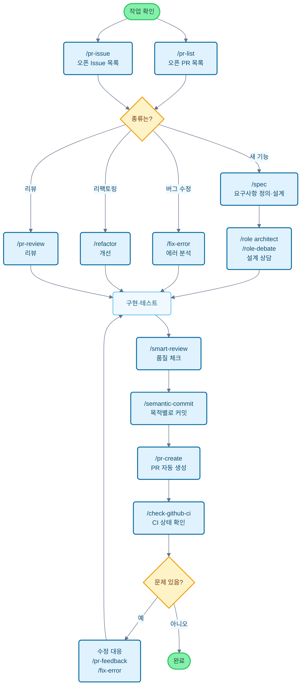

# Claude Code Cookbook

[English](README_en.md) | [中文](README_zh.md) | [한국어](README_ko.md) | [Português](README_pt.md) | [Español](README_es.md) | [日本語](README.md)

Claude Code 를 더 편리하게 사용하기 위한 설정 모음입니다.

불필요한 확인 과정을 생략하고 자동으로 작업을 진행해서, 정말 중요한 일에 집중할 수 있게 해줍니다.
코드 수정이나 테스트 실행, 문서 업데이트 같은 일상적인 작업을 Claude Code 가 알아서 판단하고 실행합니다.

## 주요 기능

세 가지 기능으로 Claude Code의 동작을 커스터마이즈할 수 있습니다:

- **Commands**: `/`로 시작하는 커스텀 명령어
- **Roles**: 전문가 관점에서 답변하는 역할 설정
- **Hooks**: 특정 시점에 스크립트 자동 실행

---

## 기능 목록

### Commands (커스텀 명령어)

`/commands` 디렉토리의 Markdown 파일로 저장되어 있습니다. `/` 다음에 파일명을 입력하면 실행됩니다.

| 명령어 | 설명 |
| :--- | :--- |
| `/analyze-dependencies` | 프로젝트 의존성을 분석하고 순환 의존성이나 구조적 문제를 시각화합니다. |
| `/analyze-performance` | 애플리케이션 성능 문제를 분석하고 기술 부채 관점에서 개선 방안을 제안합니다. |
| `/check-fact` | 프로젝트 코드베이스와 문서를 참고해서 주어진 정보의 정확성을 확인합니다. |
| `/check-github-ci` | GitHub Actions CI 상태를 모니터링하고 완료까지 추적합니다. |
| `/check-prompt` | 현재 프롬프트 내용을 검토하고 개선 사항을 제안합니다. |
| `/commit-message` | 변경 내용을 기반으로 커밋 메시지만 생성합니다. |
| `/context7` | Context7 MCP를 사용해서 컨텍스트를 관리합니다. |
| `/design-patterns` | 디자인 패턴을 기반으로 구현을 제안하거나 리뷰합니다. |
| `/explain-code` | 선택한 코드의 기능과 로직을 이해하기 쉽게 설명합니다. |
| `/fix-error` | 에러 메시지를 바탕으로 코드 수정 방안을 제시합니다. |
| `/multi-role` | 여러 역할을 조합해서 동일한 대상을 병렬 분석하고 통합 리포트를 생성합니다. |
| `/plan` | 구현 전에 계획 수립 모드를 활성화하고 상세한 구현 전략을 만듭니다. |
| `/pr-auto-update` | Pull Request 내용(설명, 라벨)을 자동으로 업데이트합니다. |
| `/pr-create` | Git 변경 분석을 기반으로 자동 PR 생성으로 효율적인 Pull Request 워크플로우를 구현합니다. |
| `/pr-feedback` | Pull Request 리뷰 코멘트를 효율적으로 처리하고, 3단계 에러 분석 방식으로 근본 해결을 추구합니다. |
| `/pr-issue` | 현재 저장소의 오픈 Issue 목록을 우선순위와 함께 표시합니다. |
| `/pr-list` | 현재 저장소의 오픈 PR 목록을 우선순위와 함께 표시합니다. |
| `/pr-review` | Pull Request를 체계적으로 리뷰해서 코드 품질과 아키텍처 건전성을 보장합니다. |
| `/refactor` | 안전하고 점진적인 코드 리팩토링을 수행하고 SOLID 원칙 준수를 평가합니다. |
| `/role-debate` | 여러 역할이 특정 주제에 대해 토론하게 합니다. |
| `/role-help` | 사용 가능한 Role 목록과 설명을 표시합니다. |
| `/role` | 지정한 역할로 행동합니다. |
| `/screenshot` | 화면 스크린샷을 캡처하고 분석합니다. |
| `/search-gemini` | Gemini를 사용해서 웹 검색을 수행합니다. |
| `/semantic-commit` | 큰 변경사항을 의미 있는 최소 단위로 나누고 시맨틱 커밋 메시지로 순차적으로 커밋합니다. |
| `/sequential-thinking` | Sequential Thinking MCP를 사용해서 복잡한 문제를 단계적으로 생각하고 결론을 도출합니다. |
| `/show-plan` | 현재 실행 계획을 표시합니다. |
| `/smart-review` | 고급 리뷰를 수행해서 코드 품질을 향상시킵니다. |
| `/spec` | 요구사항부터 Kiro의 spec-driven development를 따라 상세한 명세서를 단계적으로 작성합니다. |
| `/style-ai-writting` | AI가 생성한 것 같은 부자연스러운 문장을 감지하고 수정합니다. |
| `/task` | 전용 에이전트를 실행해서 복잡한 검색, 조사, 분석 작업을 자율적으로 수행합니다. |
| `/tech-debt` | 프로젝트의 기술 부채를 분석하고 우선순위가 정해진 개선 계획을 만듭니다. |
| `/ultrathink` | 복잡한 과제나 중요한 결정에 대해 단계적이고 구조화된 사고 프로세스를 실행합니다. |
| `/update-dart-doc` | Dart 파일의 DartDoc 주석을 체계적으로 관리하고 고품질 한국어 문서를 유지합니다. |
| `/update-doc-string` | 다국어 지원 문서 문자열을 통합적으로 관리하고 업데이트합니다. |
| `/update-flutter-deps` | Flutter 프로젝트 의존성을 안전하게 업데이트합니다. |
| `/update-node-deps` | Node.js 프로젝트 의존성을 안전하게 업데이트합니다. |
| `/update-rust-deps` | Rust 프로젝트 의존성을 안전하게 업데이트합니다. |

### Roles (역할 설정)

`agents/roles/` 디렉토리의 Markdown 파일로 정의되어 있습니다. Claude에게 전문가 관점을 부여해서 더 정확한 답변을 얻을 수 있습니다.

각 역할은 **서브 에이전트로 독립 실행**도 가능합니다. `--agent` 옵션을 사용하면 메인 대화 컨텍스트를 방해하지 않고 대규모 분석이나 전문적인 처리를 병렬로 실행할 수 있습니다.

| 역할 | 설명 |
| :--- | :--- |
| `/role analyzer` | 시스템 분석 전문가로서 코드와 아키텍처를 분석합니다. |
| `/role architect` | 소프트웨어 아키텍트로서 설계 리뷰와 제안을 제공합니다. |
| `/role frontend` | 프론트엔드 전문가로서 UI/UX와 성능에 대한 조언을 제공합니다. |
| `/role mobile` | 모바일 앱 개발 전문가로서 iOS/Android 베스트 프랙티스를 기반으로 답변합니다. |
| `/role performance` | 성능 최적화 전문가로서 속도와 메모리 사용량 개선을 제안합니다. |
| `/role qa` | QA 엔지니어로서 테스트 계획과 품질 보증 관점에서 리뷰합니다. |
| `/role reviewer` | 코드 리뷰어로서 가독성과 유지보수성 관점에서 코드를 평가합니다. |
| `/role security` | 보안 전문가로서 취약점과 보안 위험을 지적합니다. |

#### 서브 에이전트 실행 예시

```bash
# 일반 모드 (메인 컨텍스트에서 실행)
/role security
"이 프로젝트의 보안 점검해줘"

# 서브 에이전트 모드 (독립 컨텍스트에서 실행)
/role security --agent
"프로젝트 전체 보안 감사 실행"

# 멀티 역할 병렬 분석
/multi-role security,performance --agent
"시스템 전체 보안과 성능 종합 분석"
```

### Hooks (자동화 스크립트)

`settings.json`에서 설정해서 개발 워크플로우를 자동화합니다.

| 스크립트 | 이벤트 | 설명 |
| :--- | :--- | :--- |
| `deny-check.sh` | `PreToolUse` | `rm -rf /` 같은 위험한 명령 실행을 방지합니다. |
| `check-ai-commit.sh` | `PreToolUse` | `git commit` 메시지에 AI 서명이 포함되면 에러를 발생시킵니다. |
| `preserve-file-permissions.sh` | `PreToolUse` / `PostToolUse` | 편집 전 원본 권한을 저장하고 편집 후 복원합니다. Claude Code 가 권한을 변경하는 것을 방지합니다. |
| `ja-space-format.sh` | `PostToolUse` | 파일 저장 시 일본어와 영숫자 사이 공백을 자동으로 포맷합니다. |
| `auto-comment.sh` | `PostToolUse` | 새 파일 생성이나 주요 편집 시 docstring 이나 API 문서 추가를 유도합니다. |
| `notify-waiting` | `Notification` | Claude가 사용자 확인을 기다릴 때 macOS 알림 센터로 알립니다. |
| `check-continue.sh` | `Stop` | 작업 완료 시 계속할 작업이 있는지 확인합니다. |
| `(osascript)` | `Stop` | 모든 작업 완료 시 macOS 알림 센터로 완료를 알립니다. |

---

## 개발 플로우와 명령어 사용 가이드

### 일반적인 개발 플로우에서의 명령어 활용 예시



---

## 설치

```bash
# 저장소 클론
git clone https://github.com/wasabeef/claude-code-cookbook.git
cd claude-code-cookbook

# 언어 지정 설치
./scripts/install.sh ko    # 한국어
./scripts/install.sh en    # 영어
./scripts/install.sh ja    # 일본어 (기본값)
./scripts/install.sh pt    # 포르투갈어
./scripts/install.sh zh    # 중국어
./scripts/install.sh es    # 스페인어
```

Claude Desktop에서 Custom Instructions 경로를 `~/.claude`로 설정하면 완료입니다.

### 커스터마이징

- **명령어 추가**: `commands/`에 `.md` 파일을 추가하기만 하면 됩니다
- **역할 추가**: `agents/roles/`에 `.md` 파일을 추가하기만 하면 됩니다
- **Hooks 편집**: `settings.json`을 편집해서 자동화 프로세스를 변경할 수 있습니다
