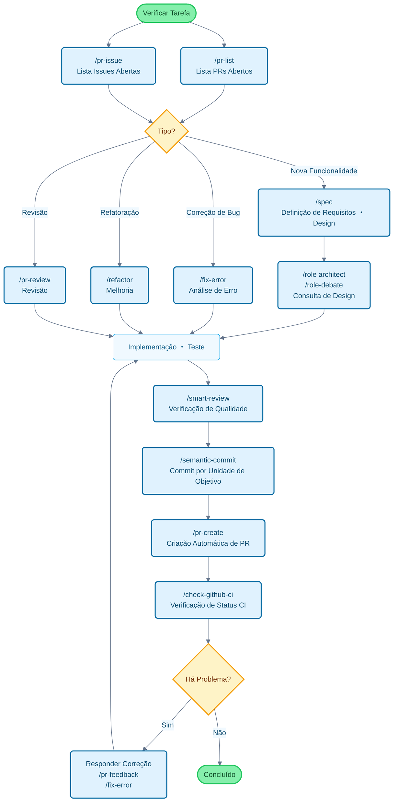

# Claude Code Cookbook

[English](README_en.md) | [中文](README_zh.md) | [한국어](README_ko.md) | [Português](README_pt.md) | [Español](README_es.md) | [日本語](README.md)

Coleção de configurações para otimizar o uso do Claude Code.

Foque no que realmente importa enquanto tarefas rotineiras são executadas automaticamente, minimizando interrupções para confirmações.
O Claude Code gerencia autonomamente atividades comuns como correções de código, execução de testes e atualização de documentação.

## Principais Funcionalidades

Personalize o comportamento do Claude Code através de três recursos principais:

- **Commands**: Comandos personalizados iniciados com `/`
- **Roles**: Configurações de papéis especializados para respostas contextualizadas
- **Hooks**: Scripts automatizados executados em momentos específicos

---

## Lista de Funcionalidades

### Commands (Comandos Personalizados)

Armazenados como arquivos Markdown no diretório `/commands`. Execute digitando `/` seguido do nome do arquivo.

| Comando | Descrição |
| :--- | :--- |
| `/analyze-dependencies` | Analisa as dependências do projeto e visualiza dependências circulares e problemas estruturais. |
| `/analyze-performance` | Analisa problemas de desempenho da aplicação e propõe melhorias do ponto de vista de dívida técnica. |
| `/check-fact` | Verifica a veracidade das informações fornecidas consultando o código-base e a documentação do projeto. |
| `/check-github-ci` | Monitora o status do CI do GitHub Actions e acompanha até a conclusão. |
| `/check-prompt` | Revisa o conteúdo do prompt atual e apresenta sugestões de melhoria. |
| `/commit-message` | Gera apenas a mensagem de commit com base nas alterações. |
| `/context7` | Gerencia contexto usando Context7 MCP. |
| `/design-patterns` | Propõe e revisa implementações baseadas em padrões de design. |
| `/explain-code` | Explica de forma clara a funcionalidade e lógica do código selecionado. |
| `/fix-error` | Apresenta sugestões de correção de código com base nas mensagens de erro. |
| `/multi-role` | Combina múltiplos papéis (Role) para analisar o mesmo alvo em paralelo e gerar um relatório integrado. |
| `/plan` | Ativa o modo de planejamento pré-implementação e elabora estratégias de implementação detalhadas. |
| `/pr-auto-update` | Atualiza automaticamente o conteúdo do Pull Request (descrição, labels). |
| `/pr-create` | Realiza fluxo de trabalho eficiente de Pull Request com criação automática de PR baseada na análise de mudanças Git. |
| `/pr-feedback` | Responde eficientemente aos comentários de revisão do Pull Request e busca resolução fundamental com abordagem de análise de erro em 3 etapas. |
| `/pr-issue` | Exibe lista de Issues abertas do repositório atual com priorização. |
| `/pr-list` | Exibe lista de PRs abertos do repositório atual com priorização. |
| `/pr-review` | Garante qualidade do código e integridade da arquitetura com revisão sistemática de Pull Request. |
| `/refactor` | Executa refatoração de código segura e gradual e avalia conformidade com princípios SOLID. |
| `/role-debate` | Faz múltiplos papéis (Role) debaterem sobre um tema específico. |
| `/role-help` | Exibe lista e descrição dos Roles disponíveis. |
| `/role` | Comporta-se como o papel (Role) especificado. |
| `/screenshot` | Captura e analisa screenshot da tela |
| `/search-gemini` | Realiza busca na Web usando Gemini. |
| `/semantic-commit` | Divide grandes mudanças em unidades mínimas significativas e faz commits sequenciais com mensagens semânticas. |
| `/sequential-thinking` | Usa Sequential Thinking MCP para pensar problemas complexos passo a passo e derivar conclusões. |
| `/show-plan` | Exibe o plano de execução atual. |
| `/smart-review` | Realiza revisão avançada e melhora a qualidade do código. |
| `/spec` | Cria especificações detalhadas passo a passo a partir de requisitos, conforme spec-driven development do Kiro. |
| `/style-ai-writting` | Detecta e corrige textos não naturais que parecem gerados por IA. |
| `/task` | Ativa agente dedicado para executar autonomamente tarefas complexas de busca, investigação e análise. |
| `/tech-debt` | Analisa a dívida técnica do projeto e cria plano de melhoria priorizado. |
| `/ultrathink` | Executa processo de pensamento estruturado e gradual para problemas complexos ou decisões importantes. |
| `/update-dart-doc` | Gerencia sistematicamente comentários DartDoc em arquivos Dart e mantém documentação de alta qualidade. |
| `/update-doc-string` | Gerencia e atualiza strings de documentação multilíngue de forma unificada. |
| `/update-flutter-deps` | Atualiza com segurança as dependências do projeto Flutter. |
| `/update-node-deps` | Atualiza com segurança as dependências do projeto Node.js. |
| `/update-rust-deps` | Atualiza com segurança as dependências do projeto Rust. |

### Roles (Configuração de Papéis)

Definidos em arquivos Markdown no diretório `agents/roles/`. Permite que o Claude adote perspectivas especializadas para fornecer respostas mais precisas e contextualizadas.

Cada papel pode ser **executado de forma independente como subagente**. Com a opção `--agent`, é possível realizar análises em larga escala ou processamento especializado em paralelo, sem afetar o contexto da conversa principal.

| Papel | Descrição |
| :--- | :--- |
| `/role analyzer` | Como especialista em análise de sistemas, analisa código e arquitetura. |
| `/role architect` | Como arquiteto de software, fornece revisões e sugestões sobre design. |
| `/role frontend` | Como especialista em frontend, fornece conselhos sobre UI/UX e desempenho. |
| `/role mobile` | Como especialista em desenvolvimento mobile, responde baseado nas melhores práticas de iOS/Android. |
| `/role performance` | Como especialista em otimização de desempenho, propõe melhorias de velocidade e uso de memória. |
| `/role qa` | Como engenheiro de QA, revisa do ponto de vista de planos de teste e garantia de qualidade. |
| `/role reviewer` | Como revisor de código, avalia código do ponto de vista de legibilidade e manutenibilidade. |
| `/role security` | Como especialista em segurança, aponta vulnerabilidades e riscos de segurança. |

#### Exemplos de Execução de Subagente

```bash
# Modo normal (execução no contexto principal)
/role security
"Verificação de segurança deste projeto"

# Modo subagente (execução em contexto independente)
/role security --agent
"Executar auditoria de segurança completa do projeto"

# Análise paralela com múltiplos papéis
/multi-role security,performance --agent
"Analisar abrangentemente segurança e desempenho de todo o sistema"
```

### Hooks (Scripts de Automação)

Configure no `settings.json` para automatizar tarefas de desenvolvimento.

| Script de Execução | Evento | Descrição |
| :--- | :--- | :--- |
| `deny-check.sh` | `PreToolUse` | Previne a execução de comandos perigosos como `rm -rf /`. |
| `check-ai-commit.sh` | `PreToolUse` | Gera erro quando `git commit` contém assinatura de IA na mensagem de commit. |
| `preserve-file-permissions.sh` | `PreToolUse` / `PostToolUse` | Salva permissões originais antes da edição de arquivo e restaura após edição. Previne Claude Code de alterar permissões. |
| `ja-space-format.sh` | `PostToolUse` | Formata automaticamente espaços entre texto e caracteres alfanuméricos ao salvar arquivo. |
| `auto-comment.sh` | `PostToolUse` | Solicita adição de docstring ou documentação API ao criar novo arquivo ou fazer edições significativas. |
| `notify-waiting` | `Notification` | Notifica via centro de notificações do macOS quando Claude está aguardando confirmação do usuário. |
| `check-continue.sh` | `Stop` | Verifica se há tarefas que podem continuar ao concluir tarefa. |
| `(osascript)` | `Stop` | Notifica conclusão via centro de notificações do macOS quando todas as tarefas são concluídas. |

---

## Fluxo de Desenvolvimento e Guia de Uso de Comandos

### Exemplos de Uso de Comandos em Fluxo de Desenvolvimento Típico



---

## Instalação

```bash
# Clonar repositório
git clone https://github.com/wasabeef/claude-code-cookbook.git
cd claude-code-cookbook

# Instalar especificando idioma
./scripts/install.sh pt    # Português
./scripts/install.sh en    # Inglês
./scripts/install.sh ja    # Japonês (padrão)
./scripts/install.sh ko    # Coreano
./scripts/install.sh zh    # Chinês
```

Configure o caminho de Custom Instructions para `~/.claude` no Claude Desktop e está concluído.

### Personalização

- **Adicionar comandos**: Apenas adicione arquivo `.md` em `commands/`
- **Adicionar papéis**: Apenas adicione arquivo `.md` em `agents/roles/`
- **Editar Hooks**: Edite `settings.json` para alterar processamento automático
