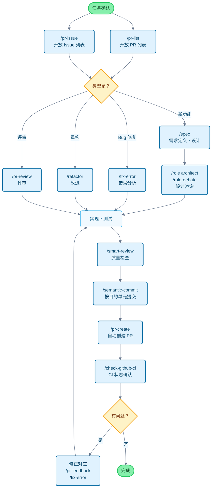

# Claude 代码食谱

这个项目是为了让 Claude Code 更加方便使用的设置集合。

它可以省去繁琐的确认步骤，自动推进工作流程，让你能够专注于真正想做的事情。代码修改、测试执行、文档更新等常见工作，Claude Code 会自主判断并执行。

## 主要功能

通过 3 个功能可以自定义 Claude Code 的行为：

- **命令（Commands）**：以 `/` 开头的自定义命令
- **角色（Roles）**：让 Claude 以专家视角回答问题的角色设置
- **钩子（Hooks）**：在特定时机自动执行脚本的机制

---

## 功能一览

### 命令（Commands）

命令以 Markdown 文件的形式保存在 `commands/` 目录中。在 Claude 中输入 `/` 后跟文件名即可执行。

| 命令 | 说明 |
| :--- | :--- |
| `/analyze-dependencies` | 分析项目依赖关系，可视化循环依赖和结构性问题。 |
| `/analyze-performance` | 分析应用程序性能问题，从技术债务角度提出改进方案。 |
| `/check-fact` | 参考项目内的代码库和文档，确认给定信息的正确性。 |
| `/check-github-ci` | 监控 GitHub Actions 的 CI 状态，跟踪直至完成。 |
| `/check-prompt` | 审查当前提示内容，提供改进建议。 |
| `/commit-message` | 根据变更内容仅生成提交消息。 |
| `/context7` | 使用 Context7 MCP 进行上下文管理。 |
| `/design-patterns` | 基于设计模式提出并审查实现方案。 |
| `/explain-code` | 通俗易懂地解释所选代码的功能和逻辑。 |
| `/fix-error` | 根据错误消息提供代码修正方案。 |
| `/multi-role` | 组合多个角色，对同一对象进行并行分析并生成综合报告。 |
| `/plan` | 启动实现前的计划模式，制定详细的实施策略。 |
| `/pr-auto-update` | 自动更新 Pull Request 的内容（说明、标签）。 |
| `/pr-create` | 基于 Git 变更分析自动创建 PR，实现高效的 Pull Request 工作流。 |
| `/pr-feedback` | 高效处理 Pull Request 的评审意见，通过错误分析三阶段方法寻求根本解决方案。 |
| `/pr-issue` | 显示当前仓库的开放 Issue 列表并排序优先级。 |
| `/pr-list` | 显示当前仓库的开放 PR 列表并排序优先级。 |
| `/pr-review` | 通过系统性的 PR 评审确保代码质量和架构健康。 |
| `/refactor` | 实施安全、渐进的代码重构，评估 SOLID 原则的遵守情况。 |
| `/role-debate` | 让多个角色就特定主题进行讨论。 |
| `/role-help` | 显示可用角色的列表和说明。 |
| `/role` | 让 Claude 以指定角色行事。 |
| `/screenshot` | 获取屏幕截图并进行分析 |
| `/search-gemini` | 使用 Gemini 进行网络搜索。 |
| `/semantic-commit` | 将大的变更拆分为有意义的最小单元，用语义化的提交消息依次提交。 |
| `/sequential-thinking` | 使用 Sequential Thinking MCP 逐步思考复杂问题并得出结论。 |
| `/show-plan` | 显示当前的执行计划。 |
| `/smart-review` | 进行高级评审，提高代码质量。 |
| `/spec` | 从需求出发，按照 Kiro 的规范驱动开发方法逐步创建详细规范文档。 |
| `/style-ai-writting` | 检测并修正 AI 生成的不自然文本。 |
| `/task` | 启动专用代理，自主执行复杂的搜索、调查和分析任务。 |
| `/tech-debt` | 分析项目的技术债务，创建优先级排序的改进计划。 |
| `/ultrathink` | 针对复杂课题和重要决策执行逐步、结构化的思考过程。 |
| `/update-dart-doc` | 系统管理 Dart 文件的 DartDoc 注释，维护高质量的日语文档。 |
| `/update-doc-string` | 统一管理和更新多语言支持的文档字符串。 |
| `/update-flutter-deps` | 安全更新 Flutter 项目的依赖关系。 |
| `/update-node-deps` | 安全更新 Node.js 项目的依赖关系。 |
| `/update-rust-deps` | 安全更新 Rust 项目的依赖关系。 |

### 角色（Roles）

角色在 `agents/roles/` 目录中的 Markdown 文件定义。让 Claude 拥有专家视角，获得更准确的回答。

每个角色都可以作为**子代理独立执行**。使用 `--agent` 选项，可以在不干扰主对话上下文的情况下，并行执行大规模分析和专业处理。

| 角色 | 说明 |
| :--- | :--- |
| `/role analyzer` | 作为系统分析专家，分析代码和架构。 |
| `/role architect` | 作为软件架构师，提供设计评审和建议。 |
| `/role frontend` | 作为前端专家，提供 UI/UX 和性能方面的建议。 |
| `/role mobile` | 作为移动应用开发专家，基于 iOS/Android 最佳实践提供回答。 |
| `/role performance` | 作为性能优化专家，提出速度和内存使用改进建议。 |
| `/role qa` | 作为 QA 工程师，从测试计划和质量保证角度进行评审。 |
| `/role reviewer` | 作为代码评审员，从可读性和可维护性角度评估代码。 |
| `/role security` | 作为安全专家，指出漏洞和安全风险。 |

#### 子代理执行示例

```bash
# 普通模式（在主上下文中执行）
/role security
「这个项目的安全检查」

# 子代理模式（在独立上下文中执行）
/role security --agent
「执行项目整体的安全审计」

# 多角色并行分析
/multi-role security,performance --agent
「全面分析系统整体的安全性和性能」
```

### 钩子（Hooks）

通过 `settings.json` 进行设置，可以自动化开发工作。

| 执行脚本 | 事件 | 说明 |
| :--- | :--- | :--- |
| `deny-check.sh` | `PreToolUse` | 防止执行 `rm -rf /` 等危险命令。 |
| `check-ai-commit.sh` | `PreToolUse` | 当 `git commit` 的提交消息中包含 AI 签名时出错。 |
| `preserve-file-permissions.sh` | `PreToolUse` / `PostToolUse` | 编辑文件前保存原始权限，编辑后恢复。防止 Claude Code 更改权限。 |
| `ja-space-format.sh` | `PostToolUse` | 保存文件时自动调整日语和英数字之间的空格。 |
| `auto-comment.sh` | `PostToolUse` | 在创建新文件或大幅编辑时，提示添加文档字符串和 API 文档。 |
| `notify-waiting` | `Notification` | 当 Claude 等待用户确认时，通过 macOS 通知中心通知。 |
| `check-continue.sh` | `Stop` | 任务完成时，检查是否有可继续的任务。 |
| `(osascript)` | `Stop` | 所有任务完成时，通过 macOS 通知中心通知完成。 |

---

## 开发流程和命令使用指南

### 一般开发流程中的命令使用示例



---

## 安装和自定义

### 安装步骤

1. **克隆仓库**: `git clone https://github.com/wasabeef/claude-code-cookbook.git ~/.claude`
2. **在客户端设置路径**: 在 Claude 客户端中指定上述目录的路径
3. **确认路径**: 确认 `settings.json` 中的脚本路径与环境匹配

### 自定义

- **添加命令**: 只需在 `commands/` 中添加 `.md` 文件
- **添加角色**: 只需在 `agents/roles/` 中添加 `.md` 文件
- **编辑钩子**: 编辑 `settings.json` 可以更改自动化处理