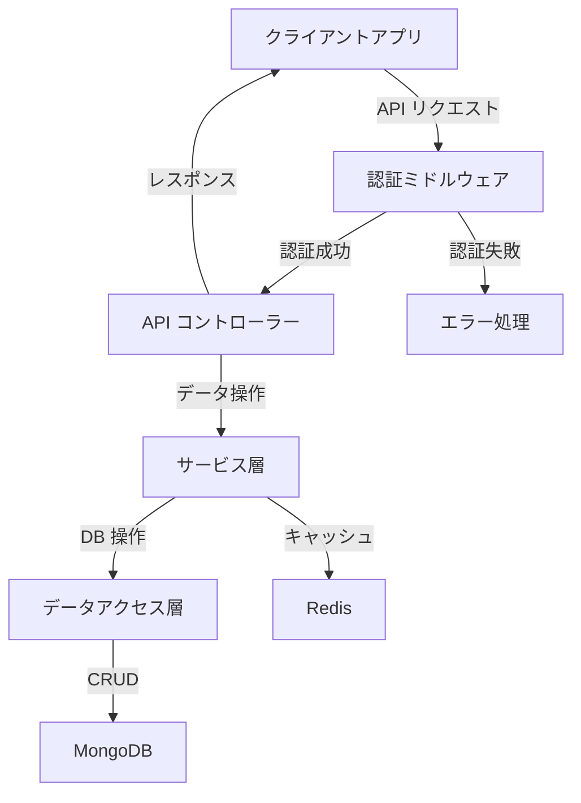

## Spec コマンド

### 使い方
`/spec [機能名]` または `/spec` と入力し、対話形式で機能仕様を定義・設計・計画します。

### 実証された効果（Kiro 実績）
- 要件定義時間の 40% 削減
- 設計レビューの指摘事項 60% 削減
- 実装バグの 50% 削減
- ドキュメント作成時間の 70% 削減

### 基本例
```
ユーザー: /spec ユーザー管理システム
Claude: 「ユーザー管理システムの要件を定義しましょう。主な機能は何ですか？」
```

### Claude との連携
- 自動的に 3 段階の対話プロセスを開始
- 各段階での承認後に関連ファイルを自動生成
- 要件や設計の曖昧さを検出して質問
- ベストプラクティスを自動適用

### Spec Mode の特徴

#### 段階的対話ワークフロー
1. **Phase 1: Requirements Discovery & Discussion** - 要件定義と議論
2. **Phase 2: Design Exploration & Discussion** - 設計探索と議論
3. **Phase 3: Implementation Planning & Discussion** - 実装計画と議論

#### 3 段階の対話的展開
```
ユーザー: /spec プロジェクト管理ツール

# Phase 1: 要件定義
Claude: 「プロジェクト管理ツールの主な機能を教えてください。」
ユーザー: 「タスク管理、チーム管理、進捗追跡、レポート生成が必要です。」
Claude: 「了解しました。以下のような要件定義を作成しました。」
→ 自動的に EARS 記法で要件定義

# Phase 2: 設計
Claude: 「技術スタックやアーキテクチャについてご意見はありますか？」
ユーザー: 「React と Node.js を使用したいです。」
Claude: 「了解しました。以下のような設計を提案します。」
→ 自動的に Mermaid 図と TypeScript インターフェース生成

# Phase 3: 実装計画
Claude: 「実装の優先順位やタイムラインについてご意見はありますか？」
ユーザー: 「1 ヶ月以内に MVP を出したいです。」
Claude: 「了解しました。以下のような実装計画を作成しました。」
→ 自動的にタスク分解とリスク分析
```

### 動的な仕様策定
- 要件の追加・修正に応じて設計と計画が自動更新
- 依存関係の変化を自動検出して警告
- 設計パターンの競合を自動検出
- 工数見積もりの自動更新

### 詳細例

#### Phase 1: Requirements Discovery & Discussion

**1. 自動拡張**
```
ユーザー: 「ユーザー管理システムの spec を作成して」
Claude: 「ユーザー管理システムの基本要件を定義しましょう。以下の質問に回答してください：

1. ユーザー登録方法（メール、SNS 連携など）
2. 認証方法（パスワード、多要素認証など）
3. 権限レベルの設定
4. プロフィール管理の内容
5. セキュリティ要件
6. その他重要な機能」
```

**2. EARS 記法**
```markdown
# ユーザー管理システムの EARS 記法による要件定義

WHEN ユーザーが新規登録を行う
GIVEN メールアドレスが未登録である
THEN システムは確認メールを送信し
AND アカウントを非アクティブ状態に設定する

WHEN ユーザーが確認メールのリンクをクリック
GIVEN リンクが有効である
THEN システムはアカウントをアクティブ化し
AND ログインページにリダイレクトする

WHILE ユーザーが多要素認証を設定中
THE SYSTEM SHALL タイムリーなフィードバックを提供し
AND セキュリティ推奨事項を表示する
```

**3. エッジケース補完**
```
Claude: 「以下のエッジケースを考慮することを推奨します：

1. メール確認の有効期限切れ
2. パスワードリセットの回数制限
3. 複数デバイスからの同時ログイン
4. 異常なログイン試行の検出
5. アカウント凍結・削除のフロー

これらのケースについて要件を定義しますか？」
```

**4. Phase 1 完了**
```
Claude: 「Requirements Phase が完了しました。requirements.md を生成してよろしいですか？」
→ 「次に進んで」→ requirements.md 生成
```

#### Phase 2: Design Exploration & Discussion

**1. コードベース分析**
```
Claude: 「既存のコードベースを分析しました。以下の技術スタックとアーキテクチャが推奨されます：

フロントエンド:
- React + Redux Toolkit
- Material-UI
- TypeScript

バックエンド:
- Node.js + Express
- MongoDB
- JWT 認証

この技術スタックで進めますか？」
```

**2. Mermaid 図**
```
Claude: 「ユーザー管理システムのアーキテクチャ図を生成しました：



このアーキテクチャで問題ありませんか？」
```

**3. TypeScript インターフェース生成**
```
Claude: 「ユーザー管理システムの TypeScript インターフェースを生成しました：

```typescript
// User モデル
interface User {
  id: string;
  email: string;
  passwordHash: string;
  firstName: string;
  lastName: string;
  role: 'admin' | 'user' | 'guest';
  isActive: boolean;
  createdAt: Date;
  updatedAt: Date;
  lastLogin: Date | null;
  twoFactorEnabled: boolean;
}

// 認証関連
interface AuthResponse {
  token: string;
  user: Omit<User, 'passwordHash'>;
}

interface LoginRequest {
  email: string;
  password: string;
  rememberMe?: boolean;
}
```

これらのインターフェースで問題ありませんか？」
```

**4. Phase 2 完了**
```
Claude: 「Design Phase が完了しました。design.md を生成してよろしいですか？」
→ 「次に進んで」→ design.md 生成
```

#### Phase 3: Implementation Planning & Discussion

**1. ベストプラクティス自動適用（Kiro 式）**
```
Claude: 「Kiro のベストプラクティスを自動適用した実装計画を生成しました：

自動生成された実装戦略:

1. セキュリティファースト開発
   - OWASP Top 10 対策の自動組み込み
   - 暗号化・ハッシュ化の自動実装
   - セキュリティテストの自動生成

2. クリーンアーキテクチャの強制
   - レイヤー分離の自動実装
   - 依存性逆転の自動適用
   - テスタブルな設計の強制

3. パフォーマンス最適化
   - キャッシュ戦略の自動実装
   - データベース最適化
   - 非同期処理の活用

このアプローチで進めますか？」
```

**2. 品質チェックポイント自動設定**
```
Claude: 「各実装段階での品質チェックポイントを自動設定しました：

自動品質保証プロセス:

Phase 3a: バックエンド実装

- [ ] セキュリティスキャン（SAST/DAST）
- [ ] API 仕様テスト（OpenAPI 準拠）
- [ ] パフォーマンステスト（負荷・レスポンス）
- [ ] 脆弱性スキャン（依存関係・ CVE）

Phase 3b: フロントエンド実装

- [ ] アクセシビリティテスト（WCAG 2.1 AA）
- [ ] ブラウザ互換性テスト
- [ ] レスポンシブデザイン検証
- [ ] セキュリティヘッダー確認

Phase 3c: 統合・デプロイ

- [ ] E2E テストスイート
- [ ] CI/CD パイプライン設定
- [ ] モニタリング・ログ設定
- [ ] 本番環境セキュリティ監査

すべて自動実行されます。追加の品質基準はありますか？」
```

**3. 依存関係とリスク軽減の自動分析**
```
Claude: 「実装順序とリスク軽減策を自動分析しました：

最適化された実装順序:

Week 1: インフラ・セキュリティ基盤

- データベース設計・スキーマ作成
- 認証基盤（JWT + セッション管理）
- セキュリティミドルウェア実装
- 基本的な API エンドポイント

Week 2: コア機能実装

- ユーザー管理機能
- プロフィール管理機能
- 権限管理システム
- バリデーション・エラーハンドリング

Week 3: 高度な機能・最適化

- 多要素認証実装
- 監査ログ機能
- パフォーマンス最適化
- フロントエンド統合

自動検出されたリスク軽減策:

- 多要素認証: 段階的導入（SMS→アプリ認証）
- セッション管理: Redis クラスター構成
- 大量アクセス: レート制限 + CDN 活用
- データ整合性: トランザクション管理強化

この計画で問題ありませんか？」
```

**4. Phase 3 完了と承認**
```
Claude: 「Implementation Planning Phase が完了しました。
tasks.md を生成してよろしいですか？」
→ 「次に進んで」→ tasks.md 生成
```

### Kiro 特有の機能

**EARS 記法 (Easy Approach to Requirements Syntax)**
```markdown
# Kiro 標準の EARS 記法パターン

WHEN [状況・トリガー]
GIVEN [前提条件]
THEN [システムの動作]
AND [追加の動作]

WHILE [状態・プロセス]
THE SYSTEM SHALL [必須動作]
AND [関連動作]

WHERE [機能・コンポーネント]
IS [条件・状態]
THE SYSTEM SHALL [対応動作]
```

**自動生成機能**

- **Mermaid 図**: アーキテクチャ・データフロー図の自動生成
- **TypeScript インターフェース**: 設計に基づく型定義自動作成
- **ベストプラクティス**: セキュリティ・パフォーマンス対策の自動組み込み
- **品質チェックポイント**: 段階別品質基準の自動設定

**hooks 連携**

- ファイル保存時の自動品質チェック
- コード標準の自動適用
- セキュリティスキャンの自動実行
- OWASP Top 10 対策の自動検証

**プロトタイプ→本番品質保証**

- 構造化アプローチによる一貫した設計
- セキュリティファースト開発の強制
- スケーラブルアーキテクチャの自動適用
- 継続的品質管理の組み込み

### 注意事項

**適用範囲**

- Spec Mode は機能実装に最適化
- 単純な修正や小規模な変更の場合は通常の実装形式を使用
- 新規機能開発や複雑な機能改修に推奨

**品質保証**

- 各段階での完了基準を明確化
- 実装前の設計レビュー
- テストとアクセシビリティを含む包括的な品質基準

**実行上の注意**

- 要件の曖昧さを解消してから設計段階へ
- 設計完了後に実装タスクを生成
- 各段階での承認プロセスを重視

### トリガーフレーズとコントロール

#### 段階的ワークフロー制御

**開始トリガー**

- 「[機能名] の spec を作成して」
- 「spec 駆動で [機能名] を開発したい」
- 「仕様書から [機能名] を設計して」

**フェーズ進行制御**

- **「次に進んで」**: 現在のフェーズを完了してファイル生成、次フェーズへ
- **「修正して」**: 現在のフェーズ内で内容を調整・改善
- **「やり直して」**: 現在のフェーズを最初からやり直し
- **「詳しく説明して」**: より詳細な説明や選択肢を提示
- **「スキップして」**: 現フェーズをスキップして次へ（非推奨）

**ファイル生成タイミング**

```
Phase 1 完了 → 「次に進んで」 → requirements.md 生成
Phase 2 完了 → 「次に進んで」 → design.md 生成
Phase 3 完了 → 「次に進んで」 → tasks.md 生成
```

### 実行例（段階的フロー）
```bash
# 使用例
ユーザー: 「ユーザー管理システムの spec を作成して」

# Phase 1: Requirements Discovery
Claude: [要件の確認と議論開始]
ユーザー: [応答・議論・修正]
Claude: 「Requirements Phase が完了しました。次に進んでよろしいですか？」
ユーザー: 「次に進んで」
→ requirements.md 生成

# Phase 2: Design Exploration
Claude: [設計の提案と議論開始]
ユーザー: [技術選択・アーキテクチャ議論]
Claude: 「Design Phase が完了しました。次に進んでよろしいですか？」
ユーザー: 「次に進んで」
→ design.md 生成

# Phase 3: Implementation Planning
Claude: [実装計画の議論開始]
ユーザー: [優先度・リスク・工数の議論]
Claude: 「Implementation Phase が完了しました。次に進んでよろしいですか？」
ユーザー: 「次に進んで」
→ tasks.md 生成

# 完了
Claude: 「spec 駆動開発の準備が完了しました。実装を開始できます。」
```

### /plan との違い

| 特徴 | /plan | /spec |
|------|-------|-------|
| 対象 | 一般的な実装計画 | 機能仕様駆動開発 |
| 出力形式 | 単一の計画ドキュメント | 3 つの独立したファイル（requirements.md、design.md、tasks.md） |
| 要件定義 | 基本的な要件整理 | EARS 記法による詳細な受け入れ基準 |
| 設計 | 技術選定中心 | コードベース分析ベース |
| 実装 | 一般的なタスク分解 | 依存関係を考慮したシーケンス |
| 品質保証 | 基本的なテスト戦略 | 包括的な品質要件（テスト、アクセシビリティ、パフォーマンス） |
| 同期 | 静的な計画 | 動的な spec 更新 |

### 推奨ユースケース

**spec 使用推奨**

- 新機能開発
- 複雑な機能改修
- API 設計
- データベース設計
- UI/UX 実装

**plan 使用推奨**

- システム全体の設計
- インフラ構築
- リファクタリング
- 技術選定
- アーキテクチャ変更