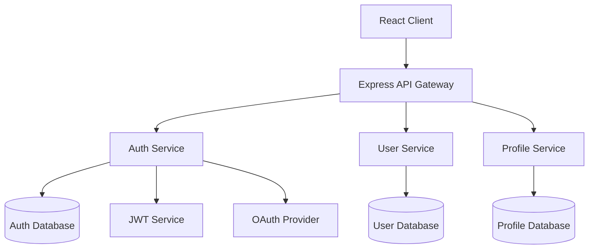

## Spec

**"Give structure before writing code"** - Fully compliant with Kiro's spec-driven development

Unlike traditional code generation tools, it realizes Kiro's specification-driven development focused on bringing structure to development chaos. From minimal requirement input, it progressively develops from detailed product manager-level specifications to implementable designs, ensuring consistent quality from **prototype to production**.

### Usage

```bash
# Request Spec Mode from Claude (minimal requirement input)
"Create a spec for [feature description]"

# Kiro's step-by-step development:
# 1. Simple requirements → Automatic generation of detailed user stories
# 2. Structured requirement descriptions using EARS notation
# 3. Refinement of specifications through step-by-step dialogue
# 4. Generation of 3 independent files:
#    - requirements.md: Requirement definitions using EARS notation
#    - design.md: Design including Mermaid diagrams and TypeScript interfaces
#    - tasks.md: Implementation plan with automatic application of best practices
```

### Proven Results (Kiro Track Record)

**Secure File Sharing App in 2 Days**

```bash
"Create a spec for a file sharing system (with encryption)"
→ Production-level encrypted file sharing application completed in 2 days
→ Automatic application of security best practices
→ No additional prompts needed
```

**Game Development in One Night (For Beginners)**

```bash
"Create a spec for a 2D puzzle game"
→ Open source developer with no game development experience
→ Game completed in one night
→ Kiro handles implementation logic, allowing developers to focus on creativity
```

**Weekend Prototype→Production**

```bash
"Create a spec for an EC site product management system"
→ Concept to working prototype in one weekend
→ Consistent quality from prototype to production
→ Structured approach through spec-driven development
```

### Basic Examples

```bash
# Create spec for new feature (minimal input)
"Product review system
- Star rating functionality
- Comment posting
- Image upload"

# Create spec for system feature
"User authentication
- OAuth support
- Multi-factor authentication"

# Create spec for API feature
"Payment system API
- Stripe integration
- Security-focused"
```

### Collaboration with Claude

```bash
# Complex feature spec
"Create a spec for chat functionality including WebSocket, real-time notifications, and history management"

# Database integration feature spec
"Create a spec for EC site inventory management functionality including product addition, inventory updates, and alert functionality"

# Frontend feature spec
"Create a spec for a React dashboard including graph display, filtering, and export functionality"

# Backend feature spec
"Create a spec for a RESTful API including authentication, validation, and logging"
```

### Features of Spec Mode

**Step-by-Step Dialogue Workflow**

- Fully reproduces Kiro's original value of step-by-step discussion
- Refines specifications collaboratively with users at each phase
- Generates files through question resolution, option discussion, and approval processes

**Three Phases of Interactive Development**

- **Phase 1**: Requirements Discovery → Discussion → Approval → `requirements.md` generation
- **Phase 2**: Design Exploration → Discussion → Approval → `design.md` generation
- **Phase 3**: Implementation Planning → Discussion → Approval → `tasks.md` generation

**Dynamic Specification Development**

- Resolves requirement ambiguities through dialogue
- Presents and discusses technical options
- Explains trade-offs and confirms decisions

### Detailed Examples

```bash
# Complex system feature
"Create a spec for an online payment system including Stripe integration, security, and error handling"

# Frontend feature
"Create a spec for a React component including state management, property design, and testing"

# Backend feature
"Create a spec for a GraphQL API including schema design, resolvers, and authentication"

# DevOps feature
"Create a spec for a CI/CD pipeline including test automation, deployment, and monitoring"
```

### Step-by-Step Dialogue Workflow (Phase by Phase)

#### Phase 1: Requirements Discovery & Discussion

**1. Automatic Expansion from Minimal Input (Kiro Style)**

```
User: "User management system
- Login functionality
- Profile editing
- Administrator permissions"

Claude: "I'll generate detailed user stories from your requirements.
Is this understanding correct?

Automatically generated user stories:
- User registration and authentication (OAuth compatible)
- Profile management (avatar, settings)
- Permission management (RBAC)
- Password reset functionality
- Security audit logs

I've supplemented details not explicitly stated. Are there any other required features?"
```

**2. Structured Requirements Description Using EARS Notation**

```
Claude: "I'll structure the requirements using Kiro's EARS notation:

Requirements defined using EARS notation:

WHEN a user attempts to log in
GIVEN they enter the correct email address and password
THEN the system shall confirm authentication
AND redirect to the dashboard on success

WHILE a user is on the profile editing screen
THE SYSTEM SHALL perform real-time validation
AND display a preview of changes

WHERE access is attempted to a feature requiring administrator privileges
IS when the system shall check permission levels
AND deny access if insufficient"
```

**3. Automatic Completion of Edge Cases and Security Requirements**

```
Claude: "Based on Kiro's best practices, I've also considered the following cases:

Security requirements (automatic completion):
- Protection against brute force attacks
- Session management and timeout
- CSRF protection and XSS countermeasures
- Password strength requirements

Edge cases (automatic detection):
- Simultaneous login restrictions
- Account lock functionality
- Data consistency during migration
- Load balancing during high traffic

Are these requirements appropriate?"
```

**5. Phase 1 Completion and Approval**

```
Claude: "The Requirements Phase is complete.
May I generate requirements.md?"
→ "Proceed" → requirements.md generation
```

#### Phase 2: Design Exploration & Discussion

**1. Codebase Analysis + Automatic Design Proposal (Kiro Style)**

```
Claude: "I've analyzed the existing codebase and propose the optimal architecture:

Codebase analysis results:
- Authentication: JWT + Express.js (v4.18.x)
- Database: PostgreSQL (v14+)
- Frontend: React + TypeScript (v18+)
- Existing patterns: Repository pattern, service layer separation

Kiro recommended architecture:
- Clean Architecture compliant
- Domain-Driven Design elements
- Partial application of CQRS pattern
- Automated security best practices

Shall we proceed with this design?"
```

**2. Visual Design with Mermaid Diagrams**

```
Claude: "I've automatically generated a system design using Mermaid diagrams:

Automatically generated architecture diagram:



Shall I also generate a data flow diagram?"

```

**3. Automatic Generation of TypeScript Interfaces**
```

Claude: "I'll automatically generate TypeScript interfaces based on the design:

Automatically generated TypeScript interfaces:

```typescript
// Domain entities
interface User {
  readonly id: UserId;
  readonly email: Email;
  readonly profile: UserProfile;
  readonly auth: AuthSettings;
  readonly permissions: Permission[];
  readonly createdAt: Date;
  readonly updatedAt: Date;
}

interface UserProfile {
  readonly displayName: string;
  readonly avatar: AvatarUrl;
  readonly preferences: UserPreferences;
}

interface AuthSettings {
  readonly passwordHash: PasswordHash;
  readonly mfaEnabled: boolean;
  readonly lastLoginAt: Date;
  readonly failedAttempts: number;
}

// Use cases
interface UserRepository {
  findById(id: UserId): Promise<User | null>;
  findByEmail(email: Email): Promise<User | null>;
  save(user: User): Promise<void>;
}

interface AuthenticationService {
  authenticate(credentials: LoginCredentials): Promise<AuthResult>;
  refreshToken(token: RefreshToken): Promise<AccessToken>;
}
```

Shall we proceed with this interface design?"

```

**4. Phase 2 Completion and Approval**
```

Claude: "The Design Phase is complete.
May I generate design.md?"
→ "Proceed" → design.md generation

```

#### Phase 3: Implementation Planning & Discussion

**1. Automatic Application of Best Practices (Kiro Style)**
```

Claude: "I've generated an implementation plan with automatic application of Kiro's best practices:

Automatically generated implementation strategy:

1. Security-first development
   - Automatic incorporation of OWASP Top 10 countermeasures
   - Automatic implementation of encryption and hashing
   - Automatic generation of security tests

2. Enforcement of clean architecture
   - Automatic implementation of layer separation
   - Automatic application of dependency inversion
   - Enforcement of testable design

3. Performance optimization
   - Automatic implementation of caching strategy
   - Database optimization
   - Utilization of asynchronous processing

Shall we proceed with this approach?"

```

**2. Automatic Setting of Quality Checkpoints**
```

Claude: "I've automatically set quality checkpoints for each implementation phase:

Automatic quality assurance process:

Phase 3a: Backend implementation

- [ ] Security scan (SAST/DAST)
- [ ] API specification test (OpenAPI compliant)
- [ ] Performance test (load/response)
- [ ] Vulnerability scan (dependencies/CVE)

Phase 3b: Frontend implementation

- [ ] Accessibility test (WCAG 2.1 AA)
- [ ] Browser compatibility test
- [ ] Responsive design verification
- [ ] Security header confirmation

Phase 3c: Integration/Deployment

- [ ] E2E test suite
- [ ] CI/CD pipeline setup
- [ ] Monitoring/logging setup
- [ ] Production environment security audit

All will be executed automatically. Are there any additional quality standards?"

```

**3. Automatic Analysis of Dependencies and Risk Mitigation**
```

Claude: "I've automatically analyzed the implementation order and risk mitigation measures:

Optimized implementation order:

Week 1: Infrastructure and security foundation

- Database design and schema creation
- Authentication foundation (JWT + session management)
- Security middleware implementation
- Basic API endpoints

Week 2: Core functionality implementation

- User management functionality
- Profile management functionality
- Permission management system
- Validation and error handling

Week 3: Advanced features and optimization

- Multi-factor authentication implementation
- Audit log functionality
- Performance optimization
- Frontend integration

Automatically detected risk mitigation measures:

- Multi-factor authentication: Phased introduction (SMS→app authentication)
- Session management: Redis cluster configuration
- High traffic: Rate limiting + CDN utilization
- Data consistency: Enhanced transaction management

Is this plan acceptable?"

```

**4. Phase 3 Completion and Approval**
```

Claude: "The Implementation Planning Phase is complete.
May I generate tasks.md?"
→ "Proceed" → tasks.md generation

```

### Kiro-Specific Features

**EARS Notation (Easy Approach to Requirements Syntax)**
```markdown
# Kiro Standard EARS Notation Patterns

WHEN [situation/trigger]
GIVEN [precondition]
THEN [system behavior]
AND [additional behavior]

WHILE [state/process]
THE SYSTEM SHALL [mandatory behavior]
AND [related behavior]

WHERE [function/component]
IS [condition/state]
THE SYSTEM SHALL [corresponding behavior]
```

**Automatic Generation Features**

- **Mermaid diagrams**: Automatic generation of architecture and data flow diagrams
- **TypeScript interfaces**: Automatic creation of type definitions based on design
- **Best practices**: Automatic incorporation of security and performance measures
- **Quality checkpoints**: Automatic setting of phase-specific quality standards

**Hooks Integration**

- Automatic quality checks on file save
- Automatic application of code standards
- Automatic execution of security scans
- Automatic verification of OWASP Top 10 countermeasures

**Prototype→Production Quality Assurance**

- Consistent design through structured approach
- Enforcement of security-first development
- Automatic application of scalable architecture
- Integration of continuous quality management

### Notes

**Scope of Application**

- Spec Mode is optimized for feature implementation
- Use normal implementation format for simple fixes or small changes
- Recommended for new feature development or complex feature modifications

**Quality Assurance**

- Clarification of completion criteria at each stage
- Design review before implementation
- Comprehensive quality standards including testing and accessibility

**Operational Notes**

- Resolve requirement ambiguities before design phase
- Generate implementation tasks after design completion
- Emphasize approval process at each stage

### Trigger Phrases and Controls

#### Step-by-Step Workflow Control

**Start Triggers**

- "Create a spec for [feature name]"
- "I want to develop [feature name] using spec-driven development"
- "Design [feature name] from specifications"

**Phase Progress Control**

- **"Proceed"**: Complete current phase, generate file, move to next phase
- **"Revise"**: Adjust or improve content within current phase
- **"Restart"**: Restart current phase from beginning
- **"Explain in detail"**: Provide more detailed explanations or options
- **"Skip"**: Skip current phase and move to next (not recommended)

**File Generation Timing**

```
Phase 1 completion → "Proceed" → requirements.md generation
Phase 2 completion → "Proceed" → design.md generation
Phase 3 completion → "Proceed" → tasks.md generation
```

### Execution Example (Step-by-Step Flow)

```bash
# Usage example
User: "Create a spec for a user management system"

# Phase 1: Requirements Discovery
Claude: [Begins requirement confirmation and discussion]
User: [Responds, discusses, makes revisions]
Claude: "The Requirements Phase is complete. May I proceed?"
User: "Proceed"
→ requirements.md generation

# Phase 2: Design Exploration
Claude: [Begins design proposal and discussion]
User: [Discusses technology selection and architecture]
Claude: "The Design Phase is complete. May I proceed?"
User: "Proceed"
→ design.md generation

# Phase 3: Implementation Planning
Claude: [Begins implementation plan discussion]
User: [Discusses priorities, risks, and effort]
Claude: "The Implementation Phase is complete. May I proceed?"
User: "Proceed"
→ tasks.md generation

# Completion
Claude: "Spec-driven development preparation is complete. You can begin implementation."
```

### Differences from /plan

| Feature | /plan | /spec |
|---------|-------|-------|
| Target | General implementation plan | Feature specification-driven development |
| Output format | Single plan document | 3 independent files (requirements.md, design.md, tasks.md) |
| Requirement definition | Basic requirement organization | Detailed acceptance criteria using EARS notation |
| Design | Technology selection focused | Codebase analysis-based |
| Implementation | General task decomposition | Dependency-aware sequence |
| Quality assurance | Basic test strategy | Comprehensive quality requirements (testing, accessibility, performance) |
| Synchronization | Static plan | Dynamic spec updates |

### Recommended Use Cases

**Recommended for spec use**

- New feature development
- Complex feature modifications
- API design
- Database design
- UI/UX implementation

**Recommended for plan use**

- System-wide design
- Infrastructure construction
- Refactoring
- Technology selection
- Architecture changes