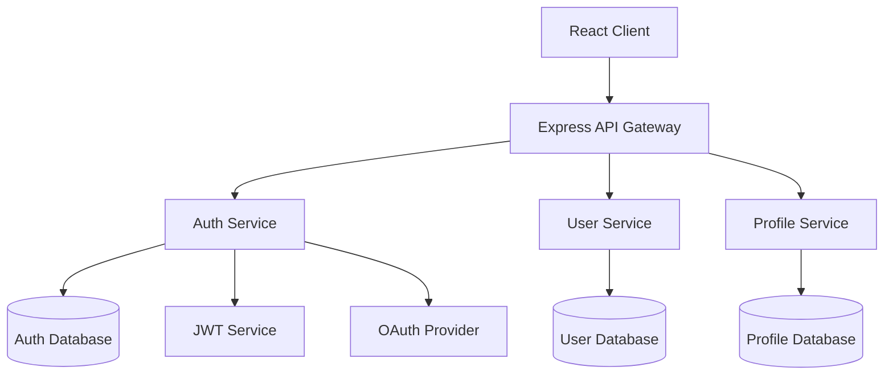

## 스펙 작성

**"코드를 작성하기 전에 구조를 부여한다"** - Kiro 의 spec-driven development 에 완전 준수

기존의 코드 생성 도구와 달리, 개발의 혼돈에 구조를 부여하는 것에 중점을 둔 Kiro 의 사양 주도 개발을 실현. 최소한의 요구사항 입력에서 프로덕트 매니저 수준의 상세한 사양과 구현 가능한 설계까지 단계적으로 전개하여, **프로토타입부터 프로덕션 환경**까지 일관된 품질을 보장합니다.

### 사용법

```bash
# Claude 에게 Spec Mode 의뢰 (최소한의 요구사항 입력)
"[기능 설명]의 spec 을 만들어주세요"

# Kiro 식 단계적 전개:
# 1. 간단한 요구사항 → 상세한 사용자 스토리 자동 생성
# 2. EARS 표기법을 통한 구조화된 요구사항 기술
# 3. 단계적 대화를 통한 사양의 정교화
# 4. 3 개의 독립적인 파일을 생성:
#    - requirements.md: EARS 표기법을 통한 요구사항 정의
#    - design.md: Mermaid 다이어그램·TypeScript 인터페이스 포함 설계
#    - tasks.md: 베스트 프랙티스 자동 적용의 구현 계획
```

### 실증된 효과 (Kiro 실적)

**2 일 만에 보안 파일 공유 앱**

```bash
"파일 공유 시스템(암호화 대응)의 spec 을 만들어주세요"
→ 2 일 만에 프로덕션 수준의 암호화 파일 공유 애플리케이션 완성
→ 보안 베스트 프랙티스 자동 적용
→ 추가 프롬프트 불필요
```

**하룻밤에 게임 개발 (미경험자)**

```bash
"2D 퍼즐 게임의 spec 을 만들어주세요"
→ 게임 개발 미경험의 오픈소스 개발자
→ 하룻밤에 게임 작성 완료
→ 구현 로직은 Kiro 가 처리, 개발자는 창조성에 집중
```

**주말에 프로토타입→프로덕션**

```bash
"쇼핑몰 상품 관리 시스템의 spec 을 만들어주세요"
→ 한 주말에 컨셉부터 동작하는 프로토타입까지
→ 프로토타입부터 프로덕션 환경까지의 일관된 품질
→ spec-driven development 을 통한 구조화된 접근
```

### 기본 예시

```bash
# 새 기능의 spec 작성 (최소한 입력)
"상품 리뷰 시스템
- 별점 기능
- 댓글 게시
- 이미지 업로드"

# 시스템 기능의 spec 작성
"사용자 인증
- OAuth 대응
- 다중 인증"

# API 기능의 spec 작성
"결제 시스템 API
- Stripe 연동
- 보안 중시"
```

### Claude 와의 연동

```bash
# 복잡한 기능 spec
"채팅 기능의 spec 을 만들어주세요. WebSocket, 실시간 알림, 히스토리 관리를 포함해서"

# 데이터베이스 연동 기능 spec
"쇼핑몰의 재고 관리 기능의 spec 을 만들어주세요. 상품 추가, 재고 업데이트, 알림 기능을 포함해서"

# 프론트엔드 기능 spec
"React 대시보드의 spec 을 만들어주세요. 그래프 표시, 필터, 내보내기 기능을 포함해서"

# 백엔드 기능 spec
"RESTful API 의 spec 을 만들어주세요. 인증, 유효성 검사, 로그 기록을 포함해서"
```

### Spec Mode 의 특징

**단계적 대화 워크플로**

- Kiro 의 본래 가치인 단계적 논의를 완전 재현
- 각 페이즈에서 사용자와 협력적으로 사양을 세련화
- 의문점 해소, 선택지 논의, 승인 프로세스를 거쳐 파일 생성

**3 단계의 대화형 전개**

- **Phase 1**: Requirements Discovery → 논의 → 승인 → `requirements.md` 생성
- **Phase 2**: Design Exploration → 논의 → 승인 → `design.md` 생성
- **Phase 3**: Implementation Planning → 논의 → 승인 → `tasks.md` 생성

**동적 사양 책정**

- 요구사항의 애매함을 대화로 해소
- 기술 선택지의 제시와 논의
- 트레이드오프의 설명과 판단 확인

### 상세 예시

```bash
# 복잡한 시스템 기능
"온라인 결제 시스템의 spec 을 만들어주세요. Stripe 연동, 보안, 오류 처리를 포함해서"

# 프론트엔드 기능
"React 컴포넌트의 spec 을 만들어주세요. 상태 관리, 속성 설계, 테스트를 포함해서"

# 백엔드 기능
"GraphQL API 의 spec 을 만들어주세요. 스키마 설계, 리졸버, 인증을 포함해서"

# DevOps 기능
"CI/CD 파이프라인의 spec 을 만들어주세요. 테스트 자동화, 배포, 모니터링을 포함해서"
```

### 단계별 대화 워크플로 (Phase by Phase)

#### Phase 1: Requirements Discovery & Discussion

**1. 최소한 입력에서 자동 확장 (Kiro 식)**

```
사용자: "사용자 관리 시스템
- 로그인 기능
- 프로필 편집
- 관리자 권한"

Claude: "요구사항에서 상세한 사용자 스토리를 생성합니다.
이 이해가 맞습니까?

자동 생성된 사용자 스토리:
- 사용자 등록·인증 기능(OAuth 대응)
- 프로필 관리 기능(아바타, 설정)
- 권한 관리 기능(RBAC)
- 비밀번호 재설정 기능
- 보안 감사 로그

명시되지 않은 세부사항을 보완했습니다. 다른 필요한 기능이 있습니까?"
```

**2. EARS 표기법을 통한 구조화 요구사항 기술**

```
Claude: "Kiro 의 EARS 표기법으로 요구사항을 구조화합니다:

EARS 표기법을 통한 요구사항 정의:

WHEN 사용자가 로그인을 시도할 때
GIVEN 올바른 이메일 주소와 비밀번호를 입력한 경우
THEN 시스템은 인증을 확인한다
AND 성공 시 대시보드로 리다이렉트한다

WHILE 사용자가 프로필 편집 화면에 있는 동안
THE SYSTEM SHALL 실시간으로 유효성 검사를 실행한다
AND 변경 내용을 미리보기 표시한다

WHERE 관리자 권한이 필요한 기능에
IS 액세스가 시도된 경우
THE SYSTEM SHALL 권한 레벨을 확인한다
AND 부족한 경우 액세스 거부한다"
```

**3. 엣지 케이스·보안 요구사항의 자동 보완**

```
Claude: "Kiro 의 베스트 프랙티스에 기반해 다음 케이스도 고려했습니다:

보안 요구사항 (자동 보완):
- 브루트 포스 공격 대책
- 세션 관리와 타임아웃
- CSRF 보호와 XSS 대책
- 비밀번호 강도 요구사항

엣지 케이스 (자동 감지):
- 동시 로그인 제한
- 계정 잠금 기능
- 데이터 마이그레이션 시 정합성 확보
- 대량 요청 시 부하 분산

이러한 요구사항이 적절합니까?"
```

**5. Phase 1 완료와 승인**

```
Claude: "Requirements Phase 가 완료되었습니다.
requirements.md 를 생성해도 되겠습니까?"
→ "다음으로 진행하세요" → requirements.md 생성
```

#### Phase 2: Design Exploration & Discussion

**1. 코드베이스 분석 + 자동 설계 제안 (Kiro 식)**

```
Claude: "기존 코드베이스를 분석해서 최적의 아키텍처를 제안합니다:

코드베이스 분석 결과:
- 인증: JWT + Express.js(v4.18.x)
- 데이터베이스: PostgreSQL(v14+)
- 프론트엔드: React + TypeScript(v18+)
- 기존 패턴: Repository 패턴, Service 계층 분리

Kiro 권장 아키텍처:
- Clean Architecture 준수
- Domain-Driven Design 요소
- CQRS 패턴의 부분적 적용
- 자동화된 보안 베스트 프랙티스

이 설계로 진행하겠습니까?"
```

**2. Mermaid 다이어그램을 통한 시각적 설계**

```
Claude: "시스템 설계를 Mermaid 다이어그램으로 자동 생성했습니다:

자동 생성된 아키텍처 다이어그램:



데이터 플로 다이어그램도 생성하겠습니까?"

```

**3. TypeScript 인터페이스 자동 생성**

```

Claude: "설계에 기반해 TypeScript 인터페이스를 자동 생성합니다:

자동 생성 TypeScript 인터페이스:

```typescript
// Domain entities
interface User {
  readonly id: UserId;
  readonly email: Email;
  readonly profile: UserProfile;
  readonly auth: AuthSettings;
  readonly permissions: Permission[];
  readonly createdAt: Date;
  readonly updatedAt: Date;
}

interface UserProfile {
  readonly displayName: string;
  readonly avatar: AvatarUrl;
  readonly preferences: UserPreferences;
}

interface AuthSettings {
  readonly passwordHash: PasswordHash;
  readonly mfaEnabled: boolean;
  readonly lastLoginAt: Date;
  readonly failedAttempts: number;
}

// Use cases
interface UserRepository {
  findById(id: UserId): Promise<User | null>;
  findByEmail(email: Email): Promise<User | null>;
  save(user: User): Promise<void>;
}

interface AuthenticationService {
  authenticate(credentials: LoginCredentials): Promise<AuthResult>;
  refreshToken(token: RefreshToken): Promise<AccessToken>;
}
```

이 인터페이스 설계로 진행하겠습니까?"

```

**4. Phase 2 완료와 승인**

```

Claude: "Design Phase 가 완료되었습니다.
design.md 를 생성해도 되겠습니까?"
→ "다음으로 진행하세요" → design.md 생성

```

#### Phase 3: Implementation Planning & Discussion

**1. 베스트 프랙티스 자동 적용 (Kiro 식)**

```

Claude: "Kiro 의 베스트 프랙티스를 자동 적용한 구현 계획을 생성했습니다:

자동 생성된 구현 전략:

1. 보안 퍼스트 개발
   - OWASP Top 10 대책의 자동 조합
   - 암호화·해싱화의 자동 구현
   - 보안 테스트의 자동 생성

2. 클린 아키텍처의 강제
   - 레이어 분리의 자동 구현
   - 의존성 역전의 자동 적용
   - 테스트 가능한 설계의 강제

3. 성능 최적화
   - 캐시 전략의 자동 구현
   - 데이터베이스 최적화
   - 비동기 처리의 활용

이 접근법으로 진행하겠습니까?"

```

**2. 품질 체크포인트 자동 설정**

```

Claude: "각 구현 단계의 품질 체크포인트를 자동 설정했습니다:

자동 품질 보증 프로세스:

Phase 3a: 백엔드 구현

- [ ] 보안 스캔(SAST/DAST)
- [ ] API 사양 테스트(OpenAPI 준수)
- [ ] 성능 테스트(부하·응답)
- [ ] 취약점 스캔(의존관계·CVE)

Phase 3b: 프론트엔드 구현

- [ ] 접근성 테스트(WCAG 2.1 AA)
- [ ] 브라우저 호환성 테스트
- [ ] 반응형 디자인 검증
- [ ] 보안 헤더 확인

Phase 3c: 통합·배포

- [ ] E2E 테스트 스위트
- [ ] CI/CD 파이프라인 설정
- [ ] 모니터링·로그 설정
- [ ] 프로덕션 환경 보안 감사

모든 것이 자동 실행됩니다. 추가 품질 기준이 있습니까?"

```

**3. 의존 관계와 위험 완화의 자동 분석**

```

Claude: "구현 순서와 위험 완화책을 자동 분석했습니다:

최적화된 구현 순서:

Week 1: 인프라·보안 기반

- 데이터베이스 설계·스키마 생성
- 인증 기반(JWT + 세션 관리)
- 보안 미들웨어 구현
- 기본적인 API 엔드포인트

Week 2: 핵심 기능 구현

- 사용자 관리 기능
- 프로필 관리 기능
- 권한 관리 시스템
- 유효성 검사·오류 처리

Week 3: 고급 기능·최적화

- 다중 인증 구현
- 감사 로그 기능
- 성능 최적화
- 프론트엔드 통합

자동 감지된 위험 완화책:

- 다중 인증: 단계적 도입(SMS→앱 인증)
- 세션 관리: Redis 클러스터 구성
- 대량 액세스: 레이트 제한 + CDN 활용
- 데이터 정합성: 트랜잭션 관리 강화

이 계획에 문제없습니까?"

```

**4. Phase 3 완료와 승인**

```

Claude: "Implementation Planning Phase 가 완료되었습니다.
tasks.md 를 생성해도 되겠습니까?"
→ "다음으로 진행하세요" → tasks.md 생성

```

### Kiro 고유 기능

**EARS 표기법 (Easy Approach to Requirements Syntax)**

```markdown
# Kiro 표준 EARS 표기법 패턴

WHEN [상황·트리거]
GIVEN [전제 조건]
THEN [시스템의 동작]
AND [추가 동작]

WHILE [상태·프로세스]
THE SYSTEM SHALL [필수 동작]
AND [관련 동작]

WHERE [기능·컴포넌트]
IS [조건·상태]
THE SYSTEM SHALL [대응 동작]
```

**자동 생성 기능**

- **Mermaid 다이어그램**: 아키텍처·데이터 플로 다이어그램의 자동 생성
- **TypeScript 인터페이스**: 설계기반의 타입 정의 자동 작성
- **베스트 프랙티스**: 보안·성능 대책의 자동 조합
- **품질 체크포인트**: 단계별 품질 기준의 자동 설정

**hooks 연동**

- 파일 저장 시 자동 품질 체크
- 코드 표준의 자동 적용
- 보안 스캔의 자동 실행
- OWASP Top 10 대책의 자동 검증

**프로토타입→프로덕션 품질 보증**

- 구조화된 접근을 통한 일관된 설계
- 보안 퍼스트 개발의 강제
- 확장 가능한 아키텍처의 자동 적용
- 지속적 품질 관리의 조합

### 주의사항

**적용 범위**

- Spec Mode 는 기능 구현에 최적화
- 단순한 수정이나 소규모 변경의 경우 일반적인 구현 방식 사용
- 새 기능 개발이나 복잡한 기능 개수에 권장

**품질 보증**

- 각 단계의 완료 기준을 명확화
- 구현 전 설계 리뷰
- 테스트와 접근성을 포함한 포괄적 품질 기준

**실행상 주의**

- 요구사항의 애매함을 해소한 후 설계 단계로
- 설계 완료 후 구현 작업을 생성
- 각 단계의 승인 프로세스를 중시

### 트리거 문구와 컨트롤

#### 단계별 워크플로 제어

**시작 트리거**

- "[기능명]의 spec 을 만들어주세요"
- "spec 주도로 [기능명]을 개발하고 싶습니다"
- "사양서부터 [기능명]을 설계하세요"

**페이즈 진행 제어**

- **"다음으로 진행하세요"**: 현재 페이즈를 완료해서 파일 생성, 다음 페이즈로
- **"수정하세요"**: 현재 페이즈 내에서 내용을 조정·개선
- **"다시 하세요"**: 현재 페이즈를 처음부터 다시
- **"자세히 설명하세요"**: 더 상세한 설명이나 선택지를 제시
- **"건너뛰어주세요"**: 현 페이즈를 건너뛰고 다음으로 (비권장)

**파일 생성 타이밍**

```
Phase 1 완료 → "다음으로 진행하세요" → requirements.md 생성
Phase 2 완료 → "다음으로 진행하세요" → design.md 생성
Phase 3 완료 → "다음으로 진행하세요" → tasks.md 생성
```

### 실행 예시 (단계별 플로)

```bash
# 사용 예시
사용자: "사용자 관리 시스템의 spec 을 만들어주세요"

# Phase 1: Requirements Discovery
Claude: [요구사항 확인과 논의 시작]
사용자: [응답·논의·수정]
Claude: "Requirements Phase 가 완료되었습니다. 다음으로 진행해도 되겠습니까?"
사용자: "다음으로 진행하세요"
→ requirements.md 생성

# Phase 2: Design Exploration
Claude: [설계 제안과 논의 시작]
사용자: [기술 선택·아키텍처 논의]
Claude: "Design Phase 가 완료되었습니다. 다음으로 진행해도 되겠습니까?"
사용자: "다음으로 진행하세요"
→ design.md 생성

# Phase 3: Implementation Planning
Claude: [구현 계획의 논의 시작]
사용자: [우선순위·위험·공수 논의]
Claude: "Implementation Phase 가 완료되었습니다. 다음으로 진행해도 되겠습니까?"
사용자: "다음으로 진행하세요"
→ tasks.md 생성

# 완료
Claude: "spec 주도 개발의 준비가 완료되었습니다. 구현을 시작할 수 있습니다."
```

### /plan 과의 차이점

| 특징 | /plan | /spec |
|------|-------|-------|
| 대상 | 일반적인 구현 계획 | 기능 사양 주도 개발 |
| 출력 형식 | 단일 계획 문서 | 3 개의 독립적 파일(requirements.md, design.md, tasks.md) |
| 요구사항 정의 | 기본적인 요구사항 정리 | EARS 표기법을 통한 상세한 수용 기준 |
| 설계 | 기술 선정 중심 | 코드베이스 분석 기반 |
| 구현 | 일반적인 작업 분해 | 의존관계를 고려한 시퀀스 |
| 품질 보증 | 기본적인 테스트 전략 | 포괄적인 품질 요구사항(테스트, 접근성, 성능) |
| 동기화 | 정적인 계획 | 동적인 spec 업데이트 |

### 권장 사용 사례

**spec 사용 권장**

- 새 기능 개발
- 복잡한 기능 개수
- API 설계
- 데이터베이스 설계
- UI/UX 구현

**plan 사용 권장**

- 시스템 전체의 설계
- 인프라 구축
- 리팩터링
- 기술 선정
- 아키텍처 변경
