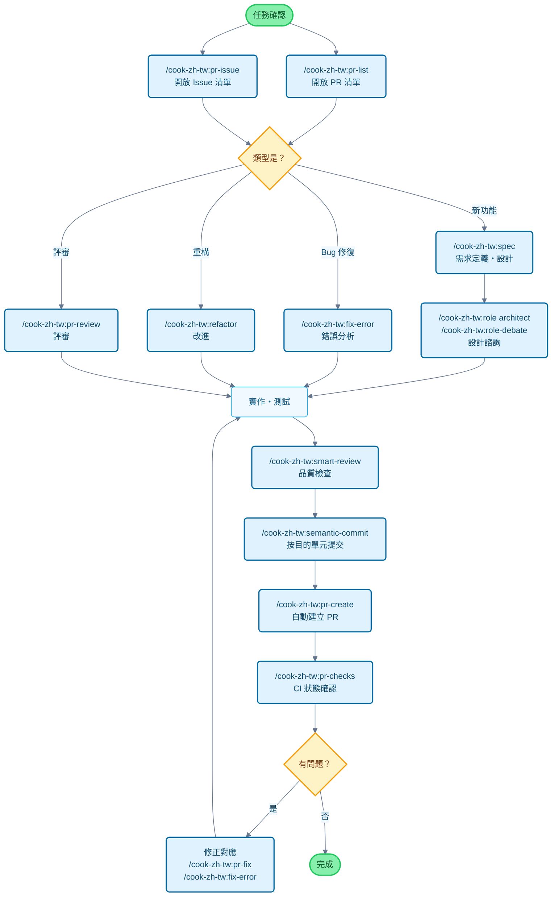

# Claude Code Cookbook

[🏠 Home](../../README.md) | [🇺🇸 English](../en/README.md) | [🇯🇵 日本語](../ja/README.md) | [🇰🇷 한국어](../ko/README.md) | [🇨🇳 简体中文](../zh-cn/README.md) | [🇹🇼 繁體中文](../zh-tw/README.md) | [🇪🇸 Español](../es/README.md) | [🇫🇷 Français](../fr/README.md) | [🇧🇷 Português](../pt/README.md)

這個專案是為了讓 Claude Code 更加方便使用的設定集合。

它可以省去繁瑣的確認步驟，自動推進工作流程，讓你能夠專注於真正想做的事情。程式碼修改、測試執行、文件更新等常見工作，Claude Code 會自主判斷並執行。

## 主要功能

透過 3 個功能可以自訂 Claude Code 的行為：

- **Commands**：以 `/` 開頭的自訂指令
- **Roles**：讓 Claude 以專家視角回答問題的角色設定
- **Hooks**：在特定時機自動執行腳本的機制

---

## 功能一覽

### 指令 (Commands)

指令以 Markdown 檔案的形式儲存在 `commands/` 目錄中。在 Claude 中輸入 `/` 後跟檔案名稱即可執行。

| 指令                    | 說明                                                                       |
| :---------------------- | :------------------------------------------------------------------------- |
| `/analyze-dependencies` | 分析專案相依關係，視覺化循環相依和結構性問題。                             |
| `/analyze-performance`  | 分析應用程式效能問題，從技術債務角度提出改進方案。                         |
| `/check-fact`           | 參考專案內的程式碼庫和文件，確認給定資訊的正確性。                         |
| `/pr-checks`      | 監控 GitHub Actions 的 CI 狀態，追蹤直至完成。                             |
| `/check-prompt`         | 審查當前提示內容，提供改進建議。                                           |
| `/commit-message`       | 根據異動內容僅產生提交訊息。                                               |
| `/context7`             | 使用 Context7 MCP 進行上下文管理。                                         |
| `/design-patterns`      | 基於設計模式提出並審查實作方案。                                           |
| `/explain-code`         | 通俗易懂地解釋所選程式碼的功能和邏輯。                                     |
| `/fix-error`            | 根據錯誤訊息提供程式碼修正方案。                                           |
| `/multi-role`           | 組合多個角色，對同一對象進行並行分析並產生綜合報告。                       |
| `/plan`                 | 啟動實作前的計劃模式，制定詳細的實施策略。                                 |
| `/pr-auto-update`       | 自動更新 Pull Request 的內容 (說明、標籤) 。                               |
| `/pr-create`            | 基於 Git 異動分析自動建立 PR，實現高效的 Pull Request 工作流程。           |
| `/pr-fix`          | 高效處理 Pull Request 的評審意見，透過錯誤分析三階段方法尋求根本解決方案。 |
| `/pr-issue`             | 顯示當前儲存庫的開放 Issue 清單並排序優先級。                              |
| `/pr-list`              | 顯示當前儲存庫的開放 PR 清單並排序優先級。                                 |
| `/pr-review`            | 透過系統性的 PR 評審確保程式碼品質和架構健康。                             |
| `/refactor`             | 實施安全、漸進的程式碼重構，評估 SOLID 原則的遵守情況。                    |
| `/role-debate`          | 讓多個角色就特定主題進行討論。                                             |
| `/role-help`            | 顯示可用角色的清單和說明。                                                 |
| `/role`                 | 讓 Claude 以指定角色行事。                                                 |
| `/screenshot`           | 獲取螢幕截圖並進行分析                                                     |
| `/search-gemini`        | 使用 Gemini 進行網路搜尋。                                                 |
| `/semantic-commit`      | 將大的異動拆分為有意義的最小單元，用語義化的提交訊息依次提交。             |
| `/sequential-thinking`  | 使用 Sequential Thinking MCP 逐步思考複雜問題並得出結論。                  |
| `/show-plan`            | 顯示當前的執行計劃。                                                       |
| `/smart-review`         | 進行高級評審，提高程式碼品質。                                             |
| `/spec`                 | 從需求出發，按照 Kiro 的規範驅動開發方法逐步建立詳細規範文件。             |
| `/style-ai-writing`     | 檢測並修正 AI 產生的不自然文字。                                           |
| `/task`                 | 啟動專用代理，自主執行複雜的搜尋、調查和分析任務。                         |
| `/tech-debt`            | 分析專案的技術債務，建立優先級排序的改進計劃。                             |
| `/ultrathink`           | 針對複雜課題和重要決策執行逐步、結構化的思考過程。                         |
| `/update-dart-doc`      | 系統管理 Dart 檔案的 DartDoc 註解，維護高品質的文件。                      |
| `/update-doc-string`    | 統一管理和更新多語言支援的文件字串。                                       |
| `/update-flutter-deps`  | 安全更新 Flutter 專案的相依關係。                                          |
| `/update-node-deps`     | 安全更新 Node.js 專案的相依關係。                                          |
| `/update-rust-deps`     | 安全更新 Rust 專案的相依關係。                                             |

### 角色 (Roles)

角色在 `agents/roles/` 目錄中的 Markdown 檔案定義。讓 Claude 擁有專家視角，獲得更準確的回答。

每個角色都可以作為**子代理獨立執行**。使用 `--agent` 選項，可以在不干擾主對話上下文的情況下，並行執行大規模分析和專業處理。

| 角色                | 說明                                                                      |
| :------------------ | :------------------------------------------------------------------------ |
| `/role analyzer`    | 作為系統分析專家，分析程式碼和架構。                                      |
| `/role architect`   | 作為軟體架構師，提供設計評審和建議。                                      |
| `/role backend`     | 作為後端開發專家，在 API 設計、微服務、雲原生、無伺服器架構方面提供建議。 |
| `/role frontend`    | 作為前端專家，提供 UI/UX 和效能方面的建議。                               |
| `/role mobile`      | 作為行動應用程式開發專家，基於 iOS/Android 最佳實務提供回答。             |
| `/role performance` | 作為效能最佳化專家，提出速度和記憶體使用改進建議。                        |
| `/role qa`          | 作為 QA 工程師，從測試計劃和品質保證角度進行評審。                        |
| `/role reviewer`    | 作為程式碼評審員，從可讀性和可維護性角度評估程式碼。                      |
| `/role security`    | 作為安全專家，指出漏洞和安全風險。                                        |

#### 子代理執行範例

```bash
# 普通模式 (在主上下文中執行)
/cook-zh-tw:role security
「這個專案的安全檢查」

# 子代理模式 (在獨立上下文中執行)
/cook-zh-tw:role security --agent
「執行專案整體的安全稽核」

# 多角色並行分析
/cook-zh-tw:multi-role security,performance --agent
「全面分析系統整體的安全性和效能」
```

### 鉤子 (Hooks)

透過 `settings.json` 進行設定，可以自動化開發工作。

| 執行腳本                       | 事件                         | 說明                                                            |
| :----------------------------- | :--------------------------- | :-------------------------------------------------------------- |
| `preserve-file-permissions.sh` | `PreToolUse` / `PostToolUse` | 編輯檔案前儲存原始權限，編輯後復原。防止 Claude Code 變更權限。 |

---

## 開發流程和指令使用指南

### 一般開發流程中的指令使用範例


```mermaid
flowchart TB
    Start([任務確認]) --> PRList["/cook-zh-tw:pr-list<br/>開放 PR 清單"]
    Start --> PRIssue["/cook-zh-tw:pr-issue<br/>開放 Issue 清單"]

    PRList --> TaskType{類型是？}
    PRIssue --> TaskType

    TaskType -->|新功能| Plan["/cook-zh-tw:spec<br/>需求定義・設計"]
    TaskType -->|Bug 修復| Fix["/cook-zh-tw:fix-error<br/>錯誤分析"]
    TaskType -->|重構| Refactor["/cook-zh-tw:refactor<br/>改進"]
    TaskType -->|評審| Review["/cook-zh-tw:pr-review<br/>評審"]

    Plan --> Design["/cook-zh-tw:role architect<br/>/cook-zh-tw:role-debate<br/>設計諮詢"]
    Design --> Implementation[實作・測試]
    Fix --> Implementation
    Refactor --> Implementation
    Review --> Implementation

    Implementation --> Check["/cook-zh-tw:smart-review<br/>品質檢查"]
    Check --> Commit["/cook-zh-tw:semantic-commit<br/>按目的單元提交"]
    Commit --> PR["/cook-zh-tw:pr-create<br/>自動建立 PR"]
    PR --> CI["/cook-zh-tw:pr-checks<br/>CI 狀態確認"]

    CI --> Status{有問題？}
    Status -->|是| Feedback["修正對應<br/>/cook-zh-tw:pr-fix<br/>/cook-zh-tw:fix-error"]
    Status -->|否| End([完成])

    Feedback --> Implementation

    classDef commandBox fill:#e0f2fe,stroke:#0369a1,stroke-width:2px,rx:5,ry:5,color:#0c4a6e
    classDef processBox fill:#f0f9ff,stroke:#0ea5e9,stroke-width:1px,rx:5,ry:5,color:#075985
    classDef decisionBox fill:#fef3c7,stroke:#f59e0b,stroke-width:2px,rx:5,ry:5,color:#78350f
    classDef startEnd fill:#86efac,stroke:#22c55e,stroke-width:2px,rx:20,ry:20,color:#14532d

    class PRList,PRIssue,Plan,Fix,Refactor,Review,Design,Check,CI,Commit,PR,Feedback commandBox
    class Implementation processBox
    class TaskType,Status decisionBox
    class Start,End startEnd

    %%{init: {'theme':'base', 'themeVariables': { 'primaryColor':'#e0f2fe', 'primaryTextColor':'#0c4a6e', 'primaryBorderColor':'#0369a1', 'lineColor':'#64748b', 'secondaryColor':'#f0f9ff', 'background':'#ffffff', 'mainBkg':'#ffffff', 'fontSize': '14px'}}}%%
```

---

## 安裝

### 步驟 1: 新增市場

首先，將此儲存庫新增為插件市場：

```bash
/plugin marketplace add wasabeef/claude-code-cookbook
```

### 步驟 2: 安裝繁體中文插件

然後，安裝繁體中文版本的插件：

```bash
/plugin install cook-zh-tw@claude-code-cookbook
```

此命令將安裝繁體中文版本的 Commands 和 Roles。

### 使用方法

安裝後，呼叫指令和代理時會自動新增 `cook-zh-tw:` 前綴：

#### 執行指令

```bash
# 帶前綴執行
/cook-zh-tw:check-fact

# 使用指令補全
/cook-zh-tw:
```

#### 呼叫代理

```bash
# 從 @ 開始搜尋代理
@agent-cook-zh-tw:frontend

# 也可以透過角色指令使用
/cook-zh-tw:role frontend
```

**注意**：外掛名稱會自動作為前綴新增。這是為了在同時安裝多個語言外掛時避免名稱衝突。

### 自訂

- **新增指令**: 只需在 `commands/` 中新增 `.md` 檔案
- **新增角色**: 只需在 `agents/roles/` 中新增 `.md` 檔案
- **編輯鉤子**: 編輯 `settings.json` 可以變更自動化處理
